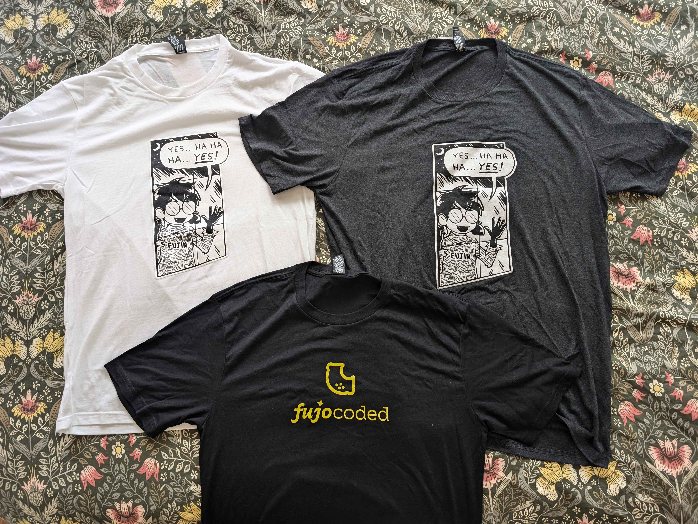
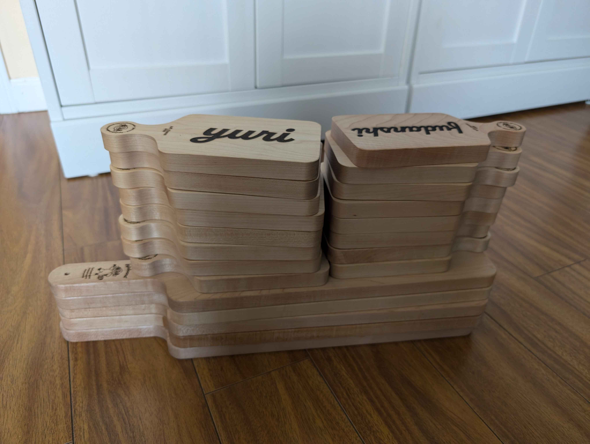
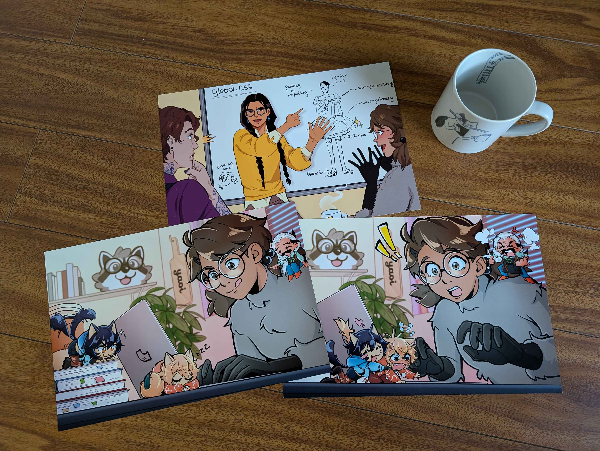

# FujoCoded, LLC August Update: Getting Conned

Good news, fujoshi fudanshi fujin and friends! We didn’t get swindled—we got invited to speak at a con!

  

Well, specifically, *our founder Ms Boba* got invited, but she’ll be representing FujoCoded LLC when she gives her talk 👍

We here at FujoCoded LLC often reflect on the importance of community and how grateful we are for your interest and support. Despite the huge number of people on the internet, it’s surprisingly easy to feel alone. That’s why we’re so psyched for **[CitrusCon](https://www.citruscon.com/)**, a **free** virtual 18+ convention for lovers of BL, queer media, and fandom as a whole. The event is meant to bring together the usual suspects of fujoshi, fudanshi, fujin, and friends, so how could we not love it? 

The con (and Ms Boba’s talk!) is coming up NEXT WEEK, so make sure to check out the bottom of this post for more details.

## Recent Progress on our BackerKit Campaign

**Fulfillment Survey Filled:** Most of you managed to fill out our survey. For the 14 that didn’t, see us after class 😉 (that is…email us at <contacts@fujocoded.com> if you have questions). That’s enough for us to move forward ordering all our incredible BackerKit rewards. Backers’ credit cards have been charged, and with the resulting funds, we have placed the necessary orders. All physical rewards are in production!

*Shirt samples!*

*our founder's laser cutter has been hard at work making FujoBoards*

*Our prints! Mug for scale.*

**“Behind the Scenes” Behind the Scenes:** The FujoCoded team all pitched in to prepare the “Behind the Scenes” files documenting the birth of the Fujoshi Guide to Web Development—even the team member with a newborn baby (👼) volunteered her time! Together we made sure these image-heavy brainstorming documents had contributor credits, image sources, alt text, and an introduction to put everything in context. Now when the Digital Goodies Pack goes live, these pieces of FujoGuide’s history will be fully accessible to all our campaign backers. Go team!

**Finally Legal:** We got engaged 💍 This is fancy legal speak to say that we have officially contracted an IP lawyer to do the special contract legalese for us. We are waiting to hear back on a cost estimate, which will determine whether we can move forward on our two top priorities—freelance writer contracts and character design rights—sequentially or simultaneously. Both of these items are critical to helping us produce the high-level communal shitposting we aspire to, while still protecting both our rights and those of the creatives we work with.

**Patronage Power-ups:** In preparation for our upcoming appearance at CitrusCon, we're working on making it possible for our supporters to directly support FujoCoded on an ongoing basis. To that end, we’re working on two different ways people can give us money!
- **Merch sales:** We're deep into coding our online store, making decisions about which features are part of the minimum viable product and which can wait for later updates
- **Patreon Swap:** We're reworking our founder Ms Boba’s [Patreon and self-hosted $upporters newsletter](https://www.patreon.com/essentialrandomness) to be FujoCoded's instead of Ms Boba's. This means changing not only the branding, but the bank accounts the money is deposited in, what the reward tiers look like, and so on. 
Things will look mostly the same for a while longer, but change is taking place behind the scenes😉

**Cheque it out:** Recurring expenses related to FujoCoded LLC, like web hosting and corporate registration, are being transferred one at a time from getting paid by our founder’s old business account to getting paid out from the abovementioned company bank account. Look ma, I’m a real boy!

## What’s Next for the FujoCoded BackerKit

**Digital Goodies PACKED:** You'll receive your digital goodies pack as soon as we start shipping out physical rewards and figure out digital rewards distribution on BackerKit. If you like the digital goodies you receive, consider subscribing to [our Patreon](https://www.patreon.com/essentialrandomness)—future digital goodies will be distributed to our regular supporters!

**IP Contracts:** Now that we've finally secured the help of an IP lawyer, we can finally move forward with upgrading our previous agreement with character designers and laying the groundwork for proper legal contracts. As you can imagine, it’s a lot cheaper for a lawyer to  edit an existing draft than to write something from scratch. This is why our new lawyer suggested we lay some of the groundwork ourselves. See **Volunteer Opportunity - Legal Research** below if you want to help! 

**IRL Shipping:** Once we have the goods in hand, we can move on to the next stage: shipping them out to all of our lovely backers. We’re still waiting for some must-have items to arrive, but we hope to start shipping before the monthly update is out!

**Becoming Ungovernable:** We need to look into the legal options for an LLC with a sociocratic structure instead of a hierarchical board-of-directors structure. We’ve assembled some example LLC membership agreements from other sociocratic companies and will be reviewing them in order to design one that works for FujoCoded LLC.

## Talk to us 🔊

**Volunteer Opportunity - Legal Research:** As we mentioned last month, we're looking for volunteers ready to brave legal language and documents to create the initial drafts of our contributor contracts by piecing together existing templates. Help us complete our prep work and move forward with IP rights agreements for our character designers, illustrators, and writers! No formal legal experience or license required (although appreciated): all contracts will be extensively reviewed by paid legal professionals before being put into use!

We didn’t get any candidates volunteering last month, but it probably would’ve helped to have included contact information with the request. If you’re interested, get in touch at <contacts@fujocoded.com> 😅

## Recent Progress on the Fujoshi Guide to Web Development

**Vol. 0, Issue 1 Resource Page:** Our all-important “Before You Start” section is done, which provides the complete list of all the prerequisite skills our readers will need to get the most out of Vol. 0, Issue 1: Git. And what kind of guide would the FujoGuide be if it didn’t give you a way to pick up its prereqs? Accordingly, the Issue 1 resource page now offers four Quick Start articles…
- Terminal Basics
- Terminal Navigation
- Installing Git
- Git Settings

…with a few more articles (like our quick overview of editing HTML and CSS files) nearing completion. In addition to featuring on the Issue 1 Resource Page, these articles will be available through the public-facing section of our educational site, where they will help us in our long-term goal of providing accessible web development education for the everyday fujin. 

**Issue Styling:** Our founder Ms Boba did a livestream showing off more zine-building in action. The issue is looking more kawaii than ever! If you missed out, you can catch the archived version of the stream [here](https://www.twitch.tv/videos/2216821006). Another great chance to see how the sausage gets made!

**Digital Goodies Pack:** We commissioned a unique badge *exclusively* for our FujoGuide Kickstarter Backers. A unique badge was the cherry on top of the digital goodies pack for our FujoCoded BackerKit campaign; we saw how much people loved that one and felt we should give our FujoGuide backers their very own. You deserve it 🥰 

And with that, our digital goodies pack will be complete! As previously mentioned, you’ll receive it at the same time as our FujoCoded BackerKit backers do—we’re all one big happy FujoVerse family 🤗

## What's Next for FujoGuide

**Multishipping:** It was overwhelmingly clear from the survey result that most people either didn't care or wanted everything in one shipment. The general feeling was “please do whatever is easier for you without stressing your contributors.” We're very grateful, and in accordance with your responses we're shelving our plan to ship the first issue on its own. We might revisit this choice (and maybe ask again) as the rest of the issues shape up.

**Soooo close:** We have a bit more styling and one last typo review before we can send the digital preview version to backers. Lastly, we’ll make the file(s) downloadable…and then it’ll be yours!

## Around the FujoVerse

### We're Going to CitrusCon!
[CitrusCon](https://www.citruscon.com/) is a free virtual 18+ convention dedicated to BL, queer media, and all things fandom that will take place August 23-25. As you saw in the introduction, our founder Ms Boba has been [invited](https://www.citruscon.com/guests-2024/ms-bobafujocoded) as a speaker! This is a great opportunity for more like-minded fujoshi and friends to learn about FujoCoded LLC, the Fujoshi Guide to Web Development, and BobaBoard. Consequently, we decided it was worth it to temporarily divert some of our organizational resources (namely: Ms Boba’s time and energy) to CitrusCon prep. 

The talk itself is slated for 6-7 PM EDT ([see timezone converter](https://www.worldtimebuddy.com/?qm=1&lid=5378538,5419384,4273837,5128581,2643743,2988507,1261481,1819729,1850147,2147714&h=5128581&date=2024-8-23&sln=18.5-19.5&hf=1)) on Friday, August 23, 2024. Here’s the writeup:

> **Title: Rebuilding Community on the (fujo)Web**
> Abstract: It's hard to agree about anything on today's internet... except that it isn't the place it used to be! In this talk, we will explore the erosion of community on the modern web and the challenges in the way of building a more user-centered online ecosystem.

To attend, all you need to do is [register](https://www.citruscon.com/attend) (for free!) by August 22. We’ll also be sending a more in-depth announcement about the planned talk in a standalone update soon after this post goes up. Hope to see some of you in the audience!

### Hang Out with FujoCoded Live on Twitch 💬✨
Because our founder Ms Boba will be speaking at CitrusCon at the end of next week, she’s forgoing her weekly stream to focus on psyching herself up for a public speaking engagement. [Weekly streams](https://www.essentialrandomness.com/streams) will resume afterward. 

If you missed the August 15th stream, you can catch it archived [here](https://www.twitch.tv/videos/2225244062) for one week after the air date.

**August**
- *Thursday, August 15 @ 3pm PDT:* [Digital Goodies Packing](https://www.twitch.tv/videos/2225244062)
- *Thursday, August 29 @ 3pm PDT:* Zine Styling Touches_final_final-2.mp4

**September**
- *Thursday, September 5 @ 3pm PDT:* All zine, all the time
- *Thursday, Septmeber 12 @ 3pm PDT:* Zine! Zine! Zine! Zine!

Alright, that should be everything! If there’s something we missed, don’t hesitate to reach out on social media or shoot us a line at <contacts@fujocoded.com>. 

The FujoCoded LLC Team
(a coven of unconventional convention-goers)

