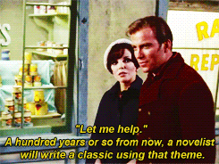

<figure>
  
  <figcaption>Longer is better, right?</figcaption>
</figure>

We’ve added THREE new headers to our newsletter format to reflect the growing diversity of stuff we’ve got going on back here.

- **“Company Credit”:** Since we often ended up discussing general company matters at the top of the update anyway, we’ve added a “general company news” subsection to keep things predictable. Enjoy!
- **“FujoStore Highlights”:** As you’ll hear in this update, we’ve got our store up and running now, so we’re adding a store-centric subsection to draw attention to store-related news.
- **“You can help!”:** Part of the reason FujoCoded LLC exists is to serve as somewhere you can do fandom-related stuff in your spare time but *also* put that stuff on your resume. Whenever we can use help, whether from volunteers, interns, consultants, or contractors, we’ll put the word out in this subsection.

Okay, now on to the update!

## Company Credit

**College Accredited:** Fujocoded has a new intern! Foxinboots, known as Fox, needed a technical internship to fulfill a college credit, so with the school’s blessing, she’s going to spend the next couple of months helping *us* help *you*. In good FujoCoded tradition, we immediately threw her in the middle of the action: her introductory task is to use her HTML and CSS (and artistic) skills to finalize the wallpapers for our digital pack, created using our open source web-based Wallpaper Maker ([https://github.com/FujoWebDev/wallpaper-maker](https://github.com/FujoWebDev/wallpaper-maker)). After that, her top priority will be finagling the delivery system for our $upporter perks, letting us finally start offering more consistent material rewards to our paying subscribers. What a way to boost that GPA! 💯

**Turning it off and (patre)on again:** Since last month, Ms Boba’s personal Patreon has been fully rebranded as [FujoCoded LLC’s Patreon](https://www.patreon.com/fujocoded). The [support page](https://www.essentialrandomness.com/support-me) on Ms Boba’s own website still allows visitors to support her directly, but you’ll see that change too as we transition out of our “seed money” crowdfunding phase and begin to beef up the company’s recurring monthly income.

**Sociocracy for All:** As previously mentioned, we’re taking steps to build FujoCoded, LLC, as a [sociocratic](https://www.sociocracyforall.org) organization—one that distributes decision-making power evenly throughout its organizational structure, rather than concentrating it at the top. The core FujoCoded team met this past week to discuss a step-by-step proposal detailing how to divide the company’s functions into departments and distribute decision-making power one domain at a time. It’s a delicate and potentially slow process, but one that’s also very near and dear to our founder’s heart—she certainly doesn’t want to get stuck having to make all the important decisions forever, and is looking forward to using that mental energy for more AUs for her many OTPs!

## Recent Progress on our BackerKit Campaign

**Contractually Obligated:** Our call for additional legal help bore fruit—we’ve acquired our first dedicated legal volunteer! With this very-welcome volunteer on our team, we are making some serious progress on the legal homework necessary to craft mutually beneficial creator contracts. Their first areas of focus are our article-writing contractors and our character design rights; more on why below.

**CitrusCon Crunch:** Ms Boba was invited to present a panel at CitrusCon (and killed it, thanks for asking 😉 Read ‘Around the FujoVerse’ for more!) In an effort to make the most of the spotlight, the whole coding team came together to get our storefront online and operational in time for the con. As one of our [campaign goals](https://www.backerkit.com/c/projects/fujocoded-llc/fujocoded-software-and-education-for-a-better-web), this storefront has been on the “To Do” list for a hot minute, and CitrusCon was just the push we needed to get it up and running. [Take a look for yourself!](https://store.fujocoded.com/) Merch from Aprils past is available there, as well as some exclusive new items—like the ‘RAWR’ paddle that recently made [a cameo](https://www.reddit.com/r/HelluvaBoss/comments/1f62s2e/this_bitch_got_a_yaoi_paddle_too_damn/#lightbox) onscreen.      

**Digital Goodies GET:** We are in the process of delivering our first and most virtual reward: the digital goodies pack. It is being delivered via Google Drive Link, and should land in an inbox near you in a matter of days. Make sure to check it out, and if you find yourself overcome by how amazing everything is, don’t be afraid to tell us 😘

**The Full Package:** All physical rewards are now under the loving stewardship of Ms Boba. We’ve got shipping boxes, updated insert cards, and all the merch you could shake a stick at. Gaze upon the beauty that together we have wrought!

![An array of FujoCoded merchandise on a wooden floor. In the back of the array are four fujoboards, with a chibi version perching on top of the two larger hime versions, all standing on end so the inscribed text is visible. Two say “rawr” and the other two say “yuri” and “yaoi.” Underneath the other merchandise are several sheets of FujoCoded logo stickers and a print of Boba-tan watching Git and GitHub squabble. On the left and right of the pile are two folded tee shirts. On top of the tee shirts are sticker packs and large FujoCoded lemon logo stickers. At the front of the array are four packing cards with FujoCoded branding that say either “hello fujin” or “say cheese.”](fujomerch-pile.png)

## What’s Next for the FujoCoded BackerKit

**Article Re-Allocation:** After reviewing our priorities, we have decided to push our NPM article to the top of the list, above the Terminal article. This is a pragmatic decision, as we already produced a short Terminal quickstart guide to prep people for **FujoGuide Vol. 0, Issue 1: Git**. If things go according to keikaku\*, that quickstart guide will give people enough information on Terminal to use NPM, and NPM lets people access the amazing world of JavaScript tooling, which is what they’ll need to team up with our trusty sidekick [Astro](https://astro.build/). (Want to know more about why you should care about Astro? Read Ms Boba’s writeup on the magic of Static Site Generators [here](https://www.essentialrandomness.com/posts/html-css-what-next#the-static-site-generation-path)!) We’ll be able to write a more in-depth exploration of Terminal when our other topics have all been covered.

*\*Translator’s note: keikaku means plan*

**Contract Scaffolding:** Before we can officially hire someone to write the NPM article, we need a workable contract. The contract is currently brewing with our legal recruit, but in the meantime, we’re nailing down key parameters like “What *exactly* are the deliverables we’re paying for?” and “what points do we need this article to cover?” The journey of a thousand words starts with a single contract, and we’re excited to take our first steps through your support!

**Coupon Clippers✂️:** One of our campaign rewards was a 20% Off coupon for all our backers. Now that we have a store to use coupons *in*, we need to figure out how to enable them. Once we have the “honor this coupon” feature turned on, you can expect your coupon to be delivered through BackerKit digital delivery.

**You’ve got mail…to send!:** Now that all the rewards are in the same place as the packing materials, there’s nothing between our beleaguered founder Ms Boba and the task of packing itself. Ms Boba has to tie up some zine work before she can turn her full attention to packing, but we anticipate things will kick off by the end of this month. What we need from you is to keep an eagle eye on your inbox: before mailing your package, we will send out a “final notice” allowing you to update your shipping address if necessary. This will give you 48 hours to make any final changes to your info. If for any reason you need us to hold your package, send us a shout at [contacts@fujocoded.com](mailto:contacts@fujocoded.com).

## Recent Progress on the Fujoshi Guide to Web Development

![A mostly black and white image of Boba-tan, a cartoon girl with glasses and pigtails wearing a raccoon kigurumi, superimposed over a repeating pattern of the Git logo. Five small figures—Terminal, HTML, Git, Aria, and CSS—are perched on the much larger Boba-tan, with Git cradled in her cupped hands. At the top of the image is the text The Fujoshi Guide to Web Development, with Volume 0 Issue 1 in smaller letters on the far left. At the bottom of the image is the book’s title, Local Version Control with Git.](fujoguide-cover-draft.png)

**Covergirl:** Boba-tan is looking easy, breezy, and beautiful on the first draft of the cover for **FujoGuide Volume 0, Issue 1: Git**. The lovely cover art was done by [ymkse](https://www.fujoweb.dev/team/ymkse), whose style you may recognize from CSS and HTML’s character designs! The idea is that for all the issues in Volume 0, Boba-Tan will appear on the cover in the same pose from issue to issue, but she’ll be surrounded by different gijinka characters each time, according to which technologies appear in each scenario. This means:    

- **Issue 1: Local Version Control with Git** features Git, Terminal, HTML, CSS, and Aria    
- **Issue 2: Version Control in the Cloud** will feature Git, Git*Hub*, Git*Lab*, and other as-yet-unseen Gits.

As for Issue 3…we’ll keep you posted!

**Even more stinkin’ badges:** We made an exclusive badge for Kickstarter backers! …but it turned out *so* pretty, and so broadly applicable, that we decided it ought to be repurposed as a badge for everybody buying our Git zine. We promised our Kickstarter backers an exclusive badge, though, so we’ve now commissioned a second one that’s going to be specific to the kickstarter, this time for real.

Here’s a non-animated sample of our repurposed Git badge:

**Pack it in:** We made our final decision about how to deliver the Digital Goodies Pack across our two crowdfunding campaigns. It took a bit of research, due to how BackerKit (our digital fulfillment system), handles multi-stage reward fulfillment. Long story short, everybody in eligible backer tiers will get a backers-only update in their email inbox where we’ll post a link to a campaign-specific google drive with all the digital goodies we promised you.

**Legal Beagle:** We put out a request for legal help with our FujoCoded LLC campaign updates as well as our FujoCoded LLC company newsletter, and someone was kind enough to respond! Along with some contract work for our FujoCoded LLC campaign commitments, they’re also helping us brainstorm and draft better contract ideas for our character designers and other artists. We want our creative contractors to get the most we can give them in the way of perks and royalties while still protecting our limited cashflow as a niche indie project, and our new legal volunteer will help with the legwork needed to make it happen.

## What’s Next for FujoGuide

**Digital Goodies Around the Corner:** You can expect to see your link to the Digital Goodies Pack in your inbox within a few days at most. We’re very excited to see these first rewards go out at last, and we’re eager to hear what you think 🥺

**Digital Preview Pre-View:** The digital preview of **FujoGuide Volume 0, Issue 1: Git** is now in its penultimate round of styling and typo-checking before we hand it off to you (whereupon you will immediately notice all the typos we missed.) It’s in what you might call the second 90% of [the 90/90 rule](https://en.wikipedia.org/wiki/Ninety%E2%80%93ninety_rule). Fingers crossed we’ll have it to you before our next campaign update!

## Around the FujoVerse

**In the press**  
The talk our founder Ms Boba gave at CitrusCon went off without a hitch and was, dare we say, *incredibly* well-received. It will be publicly available once CitrusCon publishes their recording to their [CitrusCon 2024 YouTube playlist](https://www.youtube.com/playlist?list=PLPYpKkB9QVBXkaIM6Ur41wz39yyAaZM8_), but we’ve got our own recording (plus the associated slide deck) available on [our Patreon](https://www.patreon.com/fujocoded) if you just can’t wait.

**Hang Out with FujoCoded Live on Twitch 💬✨**  
Now that CitrusCon is over, Ms Boba is back to doing [one stream a week](https://www.essentialrandomness.com/streams). Tune in every Thursday to get a peek behind the curtain and hang out with FujoCoded supporters and team members in [Twitch chat](https://twitch.tv/essentialrandomness)!

**September**

- *Thursday, September 19 @ 3pm PDT:* Digital Pack Wrap Up
- *Thursday, September 26 @ 3pm PDT:* BobaBoard Stream: Life of a Post

**October**

- *Thursday, October 3 @ 3pm PDT:* I’m Sure We’ll Be Done With The Zine By Now
- *Thursday, October 10 @ 3pm PDT:* If We Aren’t Done With the Zine I’ll Riot

## FujoStore Highlights

**Restocks, Sales, and Limited-Time Offers**  
We have our first “limited time” offer in our new store: **an exclusive RAWR charcuterie board**, created in honor of the old-school yaoi paddle [seen recently](https://www.reddit.com/r/HelluvaBoss/comments/1f62s2e/this_bitch_got_a_yaoi_paddle_too_damn/#lightbox) in a certain hell-themed animated show.

Buy your very own limited-edition [chibi](https://store.fujocoded.com/products/paddles/rawr-cheese-paddle-new-chibi-version?image=0) or [hime](https://store.fujocoded.com/products/paddles/rawr-cheese-paddle-hime-version-limited-time) paddle in our store…or share our social media posts to share this opportunity with your followers and fellow fans!

[Bluesky](https://bsky.app/profile/fujostore.bsky.social/post/3l3bk2d6ovb2r) | [Twitter](https://x.com/fujostore/status/1831049881206816829) | [tumblr](https://www.tumblr.com/fujostore/760627459461988352/whellcome-to-our-first-limited-time-edition) | [Mastodon](https://blorbo.social/@fujostore/113075216383086586)

## You can help!

<figure>

<figcaption>“Let me help”—famously even more romantic than “I love you.”</figcaption>
</figure>

This month, we’re reaching out to see if anyone would be interested in volunteering with us in the following capacities:

- **Video editing (for BobaBoard):** Our founder Ms Boba does a BobaBoard-related stream every month, passing her knowledge of how the software works down to the community. To make them truly useful, however, these streams need some polishing and some of the downtime cut out before we can upload them to our YouTube channel! If you’d like to help out (and especially if you’d like to get some professional experience in video editing onto your resume) hit us up!
- **Video highlighter (for the FujoVerse):** In addition to her BobaBoard streams, our founder also builds FujoVerse software in public once a week. While these streams are more often "watch a professional work" than outright teaching, there's a lot of useful web development knowledge buried within! If you'd like help us go through our archive to find these hidden pearls so we can cut them out and make them available to the community, let us know!
- **Task coordinator:** If you can look at a list of task deadlines and ping the people assigned to those tasks to see how they’re getting along, we could use your help! We’re experimenting with how to make this role easy and low-friction, so even if you have zero project management experience, you could be a huge help here.

If you’d like to try any of these roles, or if you’d like to get involved in other ways, let us know via [contacts@fujocoded.com](mailto:contacts@fujocoded.com).

That’s it for this month’s update! 

All the best,

The FujoCoded LLC Team  
*(a gaggle of gijinka climbing a giant woman)*