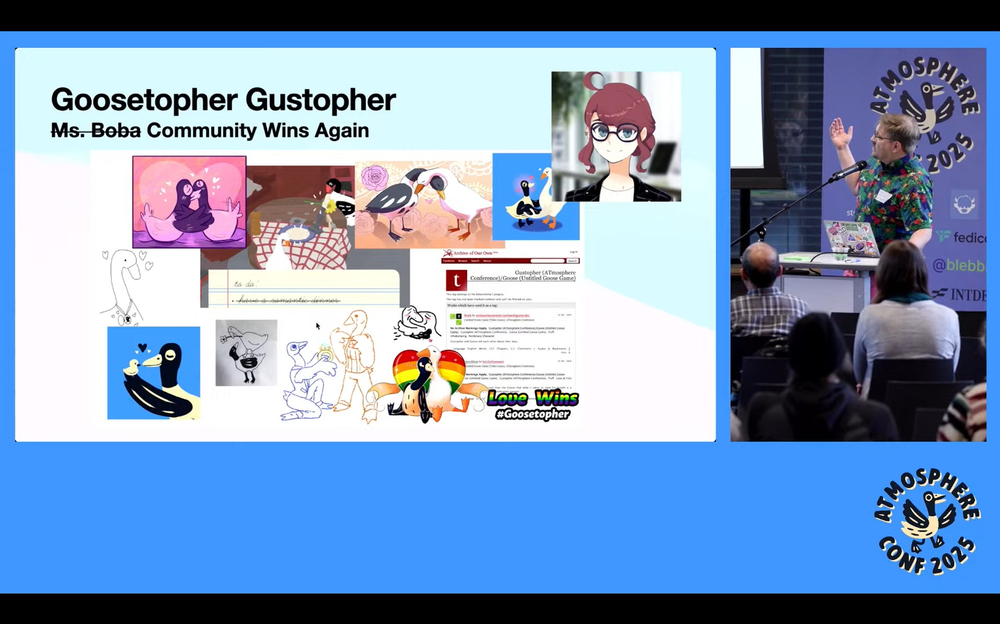
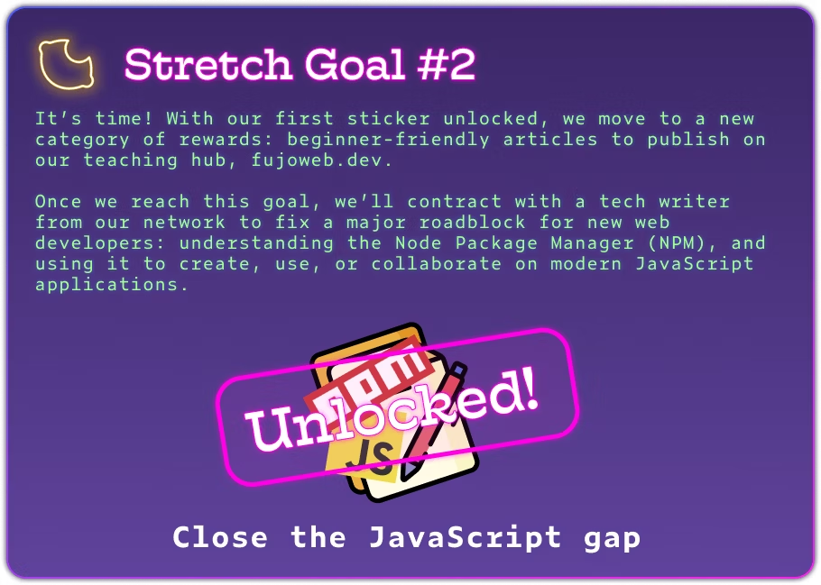
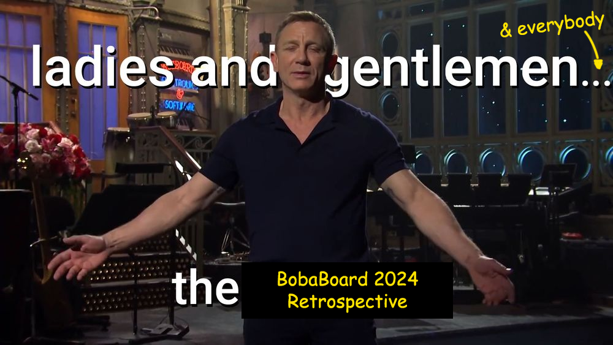

Geese (and fujin) invaded the first ATproto conference, with us leading the
charge: through the power of community (and in less than 5 hours) [we got work-safe geese
yaoi on the
screen](https://bsky.app/profile/essentialrandom.bsky.social/post/3ll3ov3hqhs2r).
Now _that_ is what we call impact!

## FujoCoded General Company News

- **Setting Some ATmosphere:** March 22-23 saw us join the [ATmosphere conference](https://atprotocol.dev/atmosphereconf/), the first conference dedicated to the ATproto ecosystem—that is, the decentralized protocol behind apps like BlueSky. It was an incredible gathering of people who _really, really care_ about a freer and more independent web, including many ActivityPub/Mastodon friends, and fujin-friendly, to say the least… ([Check out all talks here!](https://www.youtube.com/watch?v=d-H1nzWHLoI&list=PLyIg0j_mbb2tVegEMBg5ke2Z-1ALksU-I&ref=atprotocol.dev))

- **Friendly Geese:** Not only the ATmosphere Conf organizers invited Ms Boba after hearing about her [ATproto experiments for fujin](https://atfujo.fujocoded.com/), but much affectionate talk was made about everyone’s new OTP: conference mascot Gustopher and The Untitled Goose Game goose. So, in a span of just 5 hours from putting out our call to hearing back joyous honks of love, we got not just one or two, but _many_ submissions of tasteful [\#goosetopher](https://bsky.app/hashtag/Goosetopher) fanart—[we even got them on the closing slides of the conference](https://bsky.app/profile/essentialrandom.bsky.social/post/3ll3ov3hqhs2r)\! Let’s hope Gustopher’s a good influence on his new paramour.

- **Miss Speaking:** Ms Boba gave a fantastic talk at the conference to a great response from attendees and remote watchers! Throughout the conference, there was a lot of audience interest in how we can get more communities involved in the future of the (social) web, which fits perfectly with all we're doing. Check out the full details in [the BobaBoard retrospective](https://bobaboard.com/retro/development-logs-12#prelude-back-to-the-future), or go straight to [her talk: “Yearning for the Open Protocols”](https://www.youtube.com/watch?v=RbnRWKjYVn0).

  - _Just remember:_ there’s a fine line to walk between building up your professional profile, and maintaining sensible internet anonymity, which is why Ms Boba attended in disguise—if you think you now know what she looks like, no you don't!

- **Bake Sale:** In other news, we had a delicious return to April 1st tradition with a treat rather than a ~~trick~~_large-scale fundraiser_—[Yaoi fortune cookies](https://store.fujocoded.com/fandom-cookies)\! On sale were “Chocolate Doves”, “Kinda Vanilla”, and “Lemony Prompts”, each with its own set of specifically-crafted fortunes...we even got some [lovely](https://www.tumblr.com/harvestspriteirl/780416155855765504/choco-dove-sweep-this-determines-the-bedroom) [fanart](https://blorbo.social/@LeGaosaure/114309563070767137)! Chocolate Doves flew over the competition to [win our cookie run](https://bsky.app/profile/fujocoded.bsky.social/post/3lmn5ovzv6s2y), but really, aren’t we _all_ winners? Check out our contributors spotlight on [Bluesky](https://bsky.app/profile/fujocoded.bsky.social/post/3lmkmknupas2h), [Mastodon](https://blorbo.social/@fujocoded/114320796135859218), [Tumblr](https://www.tumblr.com/fujocoded/780556227268771840/with-only-24-hoursish-left-to-buy-your-fandom?source=share), or [Twitter](https://twitter.com/fujoc0ded/status/1910754458520478144)\!
- **Hiring Fun(ds):** And of course, selling cookies is not just delicious fun, it gives us enough money for our next goal: hiring a sysadmin to help us better setup our servers so they can be reliable, and will promptly alert us if anything happens\! Who knows, this might finally make us confident enough to host stuff for _you_ in the future...

## Recent Progress on Our Backerkit Campaign

- **Writing Frenzy:** It’s not all geese and gobbling, we also wrote (and then rewrote ad infinitum) the outline for our soon-to-be-famous NPM article\! We might have had it (mostly) ready for the last newsletter, but Ms Boba spent some time rearranging it after a break…_and it’s now four whole articles\!_ That might stretch the budget a bit, but it’s also going to cover most of what we’ve learned the community is struggling with...just like [our already-available Terminal content](https://learn.fujoweb.dev/quickstarts/terminal-quickstart/)!
- **Village People:** Still, it takes a village to code (and learn to code) a website so we gathered a bunch of _enthusiastic feedback_ from the Fandom Coders community. We even had it reviewed by one of BobaBoard’s professional volunteer tech writers to ensure our outline sets our future hire (see below) up for success\!

## What’s Next for the FujoCoded BackerKit

- **Extended Contracts:** Our contracts are, to quote sociocracy, “good enough for now, safe enough to try”—but they’ll need a bit of extending to cover tech writers, too! And we’ll need this ASAP because…
- **Needed Prose Masters:** …we’re looking to hire a tech writer for the NPM articles with the funds raised through the [corresponding stretch goal](https://www.backerkit.com/c/projects/fujocoded-llc/fujocoded-software-and-education-for-a-better-web#:~:text=%245000%20%E2%80%93%C2%A0%20Closing%20the%20NPM%20Loop) in our BackerKit campaign! If you’d like this to beyou (or someone you know), check out our call for hire below!

## Recent Progress on the Fujoshi Guide to Web Development
* **Beta Git Ready:** As promised, we’ve reviewed the alpha version of our GitHub guide and started our second pass, preparing it to become a full-fledged beta\! This involved a full reread to get us back into the (better-structured-than-feared) swing of things, fixing some hacky “custom zine software” workarounds from the launch of “Issue 1: Git (preview edition)”, and looking back at the original beta feedback to *git ready* from  some targeted improvements.

## What’s Next for FujoGuide
 * **Git Beta Ready:** With the beta re-read, the feedback reviewed, and all our horrible hacks forever removed from the codebase—*ah\! As if\!*—it’s time to Whip this Beta into Shape… “title of my fanfiction,” as they say.  
* **Git Ready, Beta:** As we *git* the beta ready, we also need to *git* ourselves some beta…testers\! We’ve got quite a few potential candidates from our communities, but we’ll be looking to balance a wide range of experience, interest, and operating systems to make the best guide we can. We’re planning to start mid-May (just a few weeks\!) so by the time you hear back from us again, we might have already started, or at least be close to doing so. 

## Around the FujoVerse

### In the press

- **Back to the Bubbles:** We’ve published the [Bobaboard retrospective](https://bobaboard.com/retro/development-logs-12)\! This is a once-a-year look back at everything our Bubbly Bubbles of BobaBoard volunteers (some of us included) have been up to. Whilst BobaBoard became our first graduated project last year (and thus moved out of the FujoCoded nest, it’s still deeply tied to us, and we’re helping each other as need be—especially when it comes to effort that benefits both of us (contracts\! Documentation\!)
- **Bubbling to the Future:** …and just so you know, the retrospective also includes a section on [BobaBoard’s plans for 2025](https://bobaboard.com/retro/development-logs-12#our-2025-plans-sociocracy-intensifies)\! If you’re curious what we’ll be (also) up to, go check that out\!

### Ms Boba Streaming Schedule

- **Current schedule:** With _a whole lot_ happening all around, Ms Boba’s streams are (once again) on a best-effort basis\! While she’ll try to go live on Twitch **every Thursday at 3PM Pacific**, the corresponding 3PM Monday slot comes and goes. To get notified when she streams, you can subscribe to her on [Twitch](https://www.twitch.tv/essentialrandomness), follow her on socials ([mastodon](https://indiepocalypse.social/@essentialrandom), [bluesky](https://bsky.app/profile/essentialrandom.bsky.social), [twitter](https://x.com/essentialrandom), [tumblr](https://essential-randomness.tumblr.com/)), or keep up with our programming branch, FujoWebDev ([mastodon](https://blorbo.social/@fujowebdev), [bluesky](https://bsky.app/profile/fujoweb.dev), [twitter](https://x.com/fujowebdev), [tumblr](https://fujowebdev.tumblr.com/))\!
- **What are we streaming about?** We’re currently deep into more ATproto (and lexicons)  
  experimentation with a series of streams dedicated to “building a GuestBook lexicon”\! You can catch a recording:
  1. Part 1: **Building the Lexicon:**
  2. Part 2: **Catching Events:**
     We’ll continue this series until we have a fully-working guestbook set up\!

### FujoStore Highlights: Restocks, Sales, and Limited-Time Offers

- **Cookie Up a Challenge**: We have something _in store_ (literally) for the brave explorers who can find the cookies hidden all over [our online parlor](https://store.fujocoded.com/): a FREE prize that includes (among other things) a HTML, CSS _and_ JS learn-along—or will, when it ships late May. Technically this is part of our now concluded April 1st event, and we were just too busy to remove it. But who’s complaining? Offer valid until the end of the month…_at least\!_

### You can help\!

Last but not least, our usual call for hired help and/or willing volunteers\! This month we’re once again happy to share a paid position: come forth technical writers (and aspiring such), and let us bring you on a _**N**ow **P**aying **M**oney_ adventure\!

- **Smithing Words📝…for Money (💰):** After much time, feedback, and outlining, the “Introduction to JavaScript with NPM” articles financed through our founding campaign are ready to be written\! Now <u>we’re finally looking for technical writers</u> (fannish background appreciated) to help us inspire new, confident explorers of everything [the NPM ecosystem](https://www.npmjs.com/about) has to offer—and yes, [we (also) mean Astro](https://astro.build/).

  Check out [some of the articles in our learning website](https://learn.fujoweb.dev/quickstarts/terminal-commands/) for an example of what the final artifacts should look like, and **get in touch if you’re up for the (paid) task\!** We require both basic computer knowledge and the willingness to run simple command line programs, but we don't require previous experience with _professional_ technical writing NOR pre-existing knowledge of NPM/JavaScript. Just send us some tutorials or other explainers you've written!

- **Smithing Videos📹…for Glory:** Are you willing to wrangle video wranglers? BobaBoard’s documentation bubble is looking for <u>a wondrous lead volunteer to coordinate our wonderful video volunteers</u> as they turn our many, many hours of recorded web development and BobaBoard documentation into something the whole FujoVerse™ and beyond can put to good use. If you have previous experience with managing work on video, or have been part of similar work and want to build some managing experience of your own, reach out\!

If any of these calls for aid sound up your alley, or if you’d like to get involved in other ways, please reach out at [contacts@fujocoded.com](mailto:contacts@fujocoded.com)!

That’s all folks!

Love, 
The FujoCoded Team _(A Gandering Gathering of Geese)_
