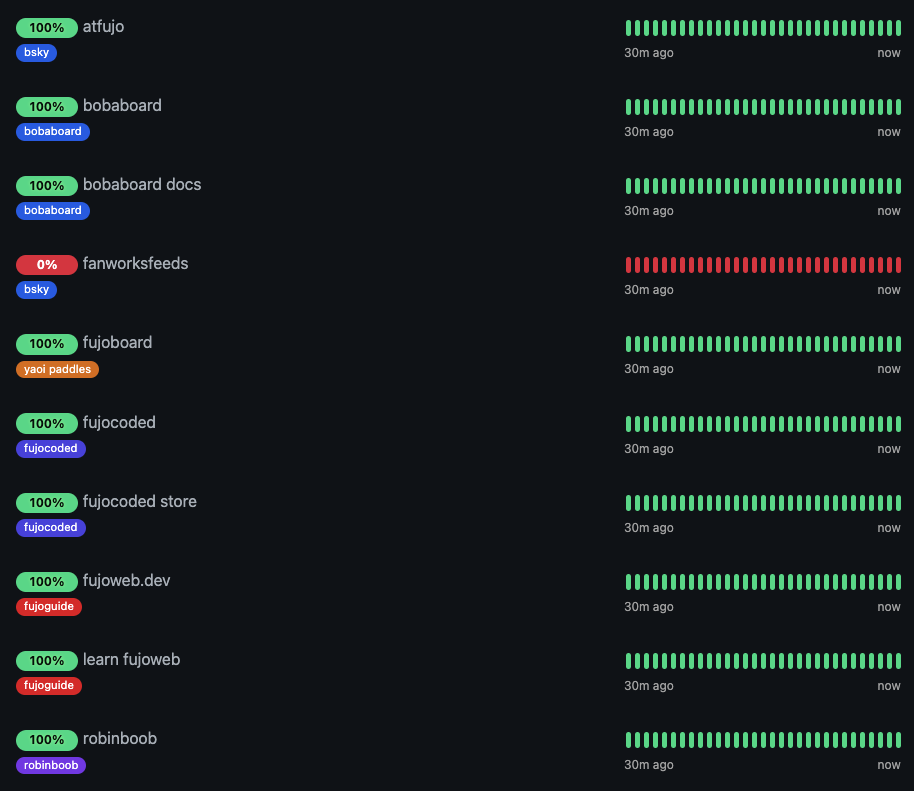
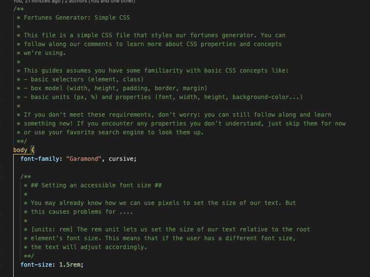
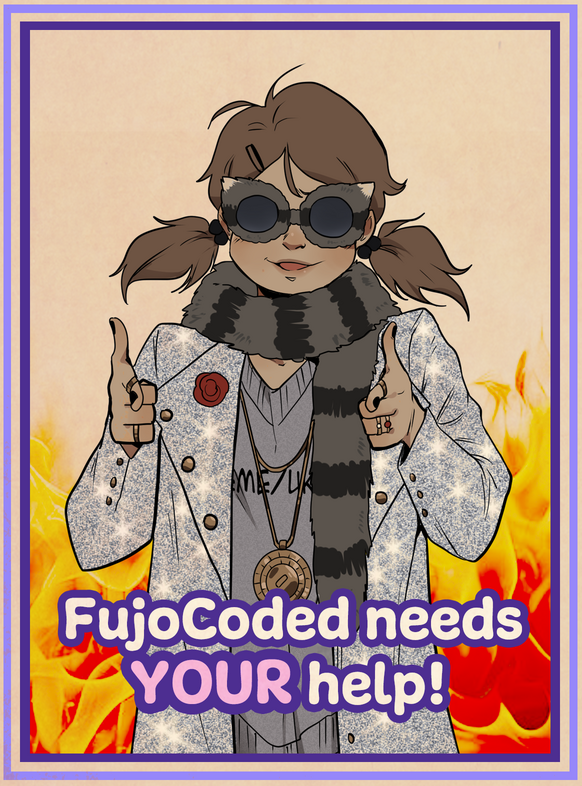

Greetings, fujoshi, fudanshi, fujin, and friends,

This month, we bring you a double-heaping of hiring, conventions, and cookies to make up for the fact that May’s newsletter is late (or is June’s early?)—we’ve got a lot more than Yaoi cookies on our plates, so we’re eager to outsource some of it. Time to put *you* (and our bake sale funds) to work. 

See below for more details! 

## FujoCoded General Company News

- **Summer Jobs** It’s hiring season! With Ms Boba’s workload getting more packed than Git's line of suitors, we have decided to wrestle as much as we can away from her and give it to some of you (for a fee)! Along with our classic [artist business card drop off](https://forms.gle/Cm2wq9numpBMoUZJA), we now have two more: one for [writers](https://forms.gle/DensB2JHppK4A98M8), and one for small-gig [HTML/CSS (and/or) JS wranglers](https://forms.gle/HNMHCJ5N5XoV35Y27)! Details at the end 👇 .

- **The Servers’ Panopticon** And speaking of hiring… Let’s celebrate the great first month-iversary of our new SysAdmin, [Kat](https://bsky.app/profile/kat.bsky.girlonthemoon.xyz)! After familiarizing herself with NixOS, she’s been going to town on our server configuration and now we can track all our different sites and tools, including when they go down.

- **How to Save a Feed** As you can see from the red above, the labeling website for [our Bluesky fanworks feed](https://bsky.app/profile/fanworkslabels.bsky.social) project has been down for quite a while. Initially, we broke the laws of DevOps and just manually resurrected it every time the server went down, but we (predictably) forgot to keep doing it after a while. Now that she’s on board, we’ve set Kat to aligning the bones and blood just right to bring it back to life… forever! \

- **Labelers Necromancy** Similarly, Kat brought our other Bluesky account labelers ([“Your Fujin Animal”](https://bsky.app/profile/fujinlabeler.bsky.social) and [“Choose your AO3 rating!”](https://bsky.app/profile/ao3labeler.bsky.social)) back to the (im)mortal plane—although the Bluesky algorithm is upset at our long absence and won’t show the labels for the latter. If you’ve been unable to get one of our badges, try again! It may not display immediately, but we’re working to appease our social overlords. All hail to Kat, our Necromancer Supreme! See [here](https://atfujo.fujocoded.com/) for more details on all our ATproto projects. \

- **That’s the Way the Cookie Crumbles** If you’re waiting for your delicious cookies (and the website trackers aren't doing it for you), they’re baking as we speak! The original order didn’t find enough gluten-free aficionados to meet minimum quantities, but after putting them back on sale briefly we smashed that threshold and got them in the oven! Production has started and soon y’all will have all the tasty treats you can cram in your mouths, whether you’re a gluten glutton or not.  \

- **Baking Your Own** We’ve been hard at work on the web-dev learn-along included in our latest digital pack: a “fortune cookie” generator website based on our cookie fortunes (with some never-before-seen ones!) The code comes in beginner and intermediate versions, and it’s chock-full of helpful comments, HTML and CSS features you may be new to, and some neat JavaScript tricks to help you get started! It was free during the fortune cookies campaign, but if you missed it [you can now pre-order it for $5](https://store.fujocoded.com/products/fandom-cookies/fandom-cookies-digital-items-pack-discounted) (or read below for a discount 👀)! \

## Recent Progress on the Fujoshi Guide to Web Development
- **No Time to Zine** With our focus on outsourcing as much work as we can (and especially hiring writers for our NPM articles) we unfortunately didn’t have space to finish the rewrite of FujoGuide Issue 2 (GitHub). But while the planned beta has slipped, we’re hoping that the onboarding of new writers will give us a lot more capacity to get this zine *and more* out to you quickly once things stabilize! 

- **Bunches of Badges** That said, we would never leave you empty-handed, so we’ve created two additional rewards: the first one is a new website badge *exclusively *for those who donated to our FujoGuide Kickstarter, which will pair up nicely with the one you already have that we give out to everyone who buys the zine...

- **A Glaring of Catboys** ...and the second reward is we’re finishing up our catboys pantheon (*penta*-on? Panther-on?), with the last 2 catboys of 5: Gitea + Forgejo now have their own character sheets, as well as exclusive designs by our own resident catboy wrangler [BrokeMyCrown](https://www.fujoweb.dev/team/brokemycrown), who authored our whole cat-ty lineup. These two twins have been at each other's throats since Gitea sold out to Big Daddy Microsoft and became a teaboo, but we’re planning to corral them into your rewards folder soon (or email inbox if you’ve lost that).

- **Back-alley Catboys** If you didn’t back our KickStarter but would still like to Kick Back with the Katboys™ (or our other behind-the-scenes material) head down to our [Patreon](https://www.patreon.com/fujocoded) for character and production sheets, free wallpapers, and other goodies! We looked into setting up our catboys with an OnlyFans instead, but they kept knocking the cameras over and it was a whole mess. 

## What’s Next for FujoGuide
- **Git’ing Touchy** We’re putting the final touches on the new badges and catboy character sheets, and they’ll be corralled into your rewards folder soon! If you can’t remember where that is, don’t worry: we’ll be sending out email reminders too. If only we can find it... 

- **Beta? I ‘ardly know ‘er! (sorry)** Don’t worry: we’re still planning to get the GitHub beta underway as soon as we can! Ms Boba’s currently focused on CitrusCon like a pirate dying of scurvy, but once we resurrect her using dark magic (that is, plenty of coffee) we’ll be sailing full steam ahead to getting this out. We’ll keep you posted! 
 

## Around the FujoVerse

### In the press
* **Getting Conned 2: the Reconnening **We’ll be attending [CitrusCon](https://www.citruscon.com/) again, with Ms Boba giving a talk on how to work together as a community even when everything, well... *kinda sucks*. 

![ID: A screenshot event listing for CitrusCon titled "Working Together in a Dying World".

The host is Ms Boba (she/her) from FujoCoded over Zoom and it runs 1:30PM - 2:30PM Eastern Timezone. 

The description is "There's no denying it: shit's fucked. From the internet to the world at large—and even within our own communities—it feels like everything’s falling apart. If we're going to make it through, we'll have to do what every ragtag team must: learn to work together. But how do you do that when everything already feels too much?"

End ID](images/citruscon_talk.png)

At the con you’ll also find a discount code for our store, and a space to come meet us and get help with your web-dev questions. **If you’d like to [register](https://www.eventbrite.com/e/citrus-con-2025-tickets-949332648507), it’s free but you gotta do it by June 19th!** 

- **Better Late than Never: **And speaking of Ms Boba yapping about building collaborative organizations, she’s just started publishing the blog version of her talk from last year’s CitrusCon, [“Rebuilding Community on the (Fujo)Web”](https://www.essentialrandomness.com/posts/rebuilding-community-on-the-web/part-1). It’s got everything you want in a fic—I mean, talk: interpersonal struggle, power dynamics, and a call for Fujos to Assemble.

- **Leaving the Nest **We also started transitioning the governance of our Fandom Coders Discord server to [Sociocracy](https://www.sociocracyforall.org/content/), so that it can grow big and strong with the direct support of its members. This’ll help in our effort to make FujoCoded’s own load more sustainable, and means the community will soon have the power to decide how its own spaces should be run. The first meeting of the Transition bubble/team kicked off to a great start, and the second meeting is already scheduled. 

- **Taken for Granted** Ms Boba [won](https://bsky.app/profile/essentialrandom.bsky.social/post/3lqb53vot7c23) a coveted “[graze grant](https://bsky.app/profile/graze.social/post/3lohcyw37fc2j)” for her ongoing [ATproto guestbook project](https://github.com/FujoWebDev/lexicon-guestbook), which you can watch her [build on stream](https://www.twitch.tv/collections/OdaSBo9XORgtPQ). She’s planning to use that grant to finance technical writing specifically around that project, making decentralization through [ATproto](https://atproto.com/) more legible to technical and non-technical folks alike. Once done, the guestbook will let you start collecting messages from friends and visitors, even on static sites like Neocities! 

### Ms Boba Streaming Schedule

...and speaking of the guestbook, it’s now officially named Tomo, borrowing from the Japanese for “friend”, and the Italian word for “book”! We’re continuing to stream its ongoing development every Thursday at 3PM Pacific. Come along on [Twitch](https://www.twitch.tv/essentialrandomness) and spectate (or heckle) Ms Boba as she wrestles code into place and suplexes syntax errors.  \
In the meantime, you can find all of the progress to date [on the dedicated Twitch collection](https://www.twitch.tv/collections/OdaSBo9XORgtPQ). Hope to see you there! 

### FujoStore Highlights: Restocks, Sales, and Limited-Time Offers

- As we’re right out of our cookie sale, we didn’t have the time to plan any special offer for you this month, but CitrusCon’s gonna have a special goodie bag that will include a discount code for our store

- ...and as ever all of our lovely [Patreon](https://www.patreon.com/fujocoded) $upporters get a 15% discount off of **all **our merch, **all **year long! 

### Paid Opportunities: You can help!

As part of our push for more moneyful delegation, we’re going to periodically open new opportunities for people to pitch in and get paid! If you’re interested in throwing your [yaoi paddle](https://store.fujocoded.com/products/paddles) in the ring, fill out the forms below and we’ll be in touch when a good match shows up.

- **✏️ Writers assemble!** Do you want to help with our NPM articles? Or maybe, you want to help us [sell the lore behind our catboys (and beyond)](https://www.fujoweb.dev/characters) to the wider public? Our [Writers Intake Form](https://forms.gle/DensB2JHppK4A98M8) is for you!

- 💻 **WebDev Gigs incoming!** There is *a lot* going on in the FujoVerse™ and many pages (like our [FujoGuide Volume 0 one](https://www.fujoweb.dev/volume-0)) could use some TLC from entry-level HTML/CSS-wranglers. We also have a few other challenges at different levels we’ll be looking to take care of as we grow. [Join the fight here!](https://forms.gle/HNMHCJ5N5XoV35Y27)  

- 🖼️ **Art(ist) Archive! **We’ve got some character art needs in the pipeline (don’t we always?), and we’d love to have even more artists on tap for when that gets firmed up—monsterfucking tendencies appreciated but not required. [Add your info here!](https://forms.gle/Cm2wq9numpBMoUZJA)

## That’s all, folks!

And with this, our update for May/June (Mune?) concludes. See you next month ([and on
Twitch](https://www.twitch.tv/essentialrandomness)) for more adventures
together!

Love,  The FujoCoded Team _(A Confluence of Calamities)_

