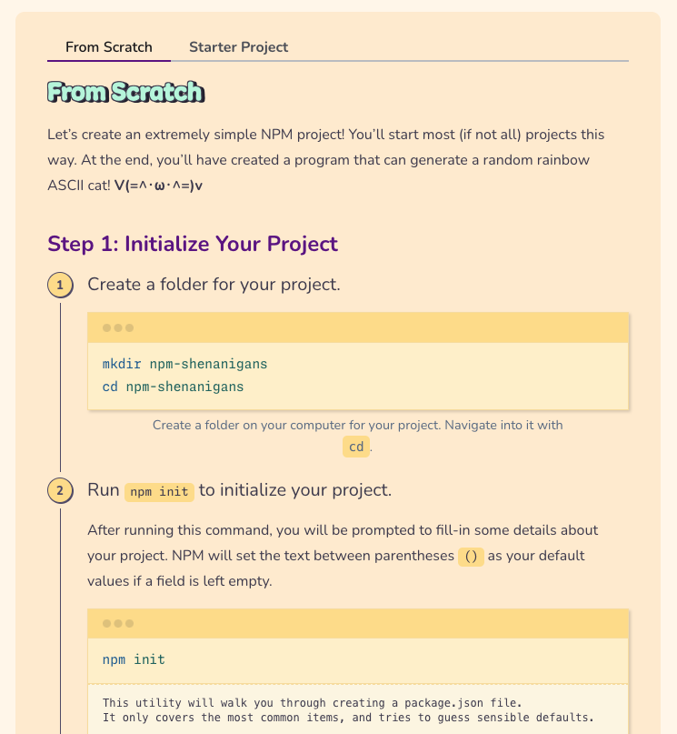

Greetings, _fu(jo|dan|jin)_ and friends,
  It's been a busy busy time in the Fujoverse: plenty of lessons
learned, cool stuff sent out (and preparing to be sent), plus [new learn@
articles](https://learn.fujoweb.dev/)—and how could we forget...the
catboys?

Let's dive right in!

## FujoCoded General Company News

- **Buy Our Love:** We have not one, but [TWO new Patreon
  tiers](https://www.patreon.com/join/fujocoded): **"Supporter Georg”**, because
  someone asked to give us $100, and **“You Fund Me(ette)?”**, because we had to
  make a $50 one too, just for good measure\! We’re running out of names though
  so don’t ask us for $200… unless? 👀 (if you can't [find them on
  Patreon](https://www.patreon.com/join/fujocoded), just keep clicking to the
  right 😜)
- **Lemon-stealing Applause:** Ms Boba’s CitrusCon talk **“Working Together in
  a Dying World”debuted to raving reviews.** If you want to ~~hear~~ read about
  toxic collaboration triangles, and toxic triangular villains, [you can find
  the slides here](https://essentialrandomness.com/working-together) and
  various thematically-related works on AO3, we’re sure.

  

- **That’s How the Cookie Crumbles:** **Our [Fandom
  Cookies](https://store.fujocoded.com/) are all mailed out** and no longer
  threaten to crush Ms Boba in a devastating, if hilarious, avalanche—which
  means people have already been stuffing their mouths with delicious treats\!
  And also the cookies. Thanks to
  [Linky](https://blorbo.social/@linky/114880930048195252) and an Anonymous
  Supporter for the promo pics\!

  

  

- **Here’s Some We Made Earlier:** If that’s not enough, **[the Digital Cookie
  Pack](https://store.fujocoded.com/products/other/fandom-cookies-digital-items-pack)
  is also nearly ready** and we’ve hired
  [Hyena](https://fluffyhyena.neocities.org/), also featured in our promotional
  art, to make some delicious cookie-themed wallpapers using both their
  immensurate visual skills _and_ [our CSS wallpaper
  maker](https://github.com/FujoWebDev/wallpaper-maker).

- **Getting Our Teaching Degree:** Speaking of the [Digital Cookie
  Pack](https://store.fujocoded.com/products/other/fandom-cookies-digital-items-pack)**,**
  **we’re _also_ working on [the promised JS/HTML/CSS
  learn-along](https://store.fujocoded.com/products/other/fandom-cookies-digital-items-pack).**
  It is going steady, but ut taught us that even our multitasking has limits… at
  least when it comes to deadlines. Next time, only a “basic" _or_ “fancy" code
  version in our learn-alongs, not both!

- **Planning for Success:** Q3 planning for Fujoverse is done, in the nick of
  time\! **We’re going to continue hiring more people, and laying the
  foundations to make our work sustainable**, so that Ms Boba no longer wakes up
  in a cold (or hot?) sweat thinking about (teaching) TypeScript. You can read
  [about our NPM articles outsourcing
  below](#FujoCoded-BackerKit-Fulfillment-Progress:-Recent) or simply gaze at
  one of Ms Boba’s humungous project management charts in equal awe and fear\!

  

  If you’d like to be confronted by one of those monstrosities (and paid for
  your service), [drop your card in the hiring section below](#we-are-hiring)!

## FujoCoded Backerkit Update

### FujoCoded BackerKit Fulfillment Progress: Recent

- **NPMployees:** **We landed our first articles**—that you paid for\!—**written by
  someone _other_ than Ms Boba**, and learned a lot from the process\! Such as
  “_Wow, this stuff costs money_” and “_Huh, other people write differently to me_”.
  Even with these obstacles our hired writers knocked it out of the park. You
  can find the fruits of their labour [in the new “JavaScript beyond the
  Browser” section](https://learn.fujoweb.dev/) of learn@fujoweb.dev\!

  

- **Feeding Frenzy:** We’ve also learned that _holy hell_, **fans tasked with
  “just uploading” new article drafts on our learning site will instead rip
  them apart** like piranhas on a cow, and rebuild them better like… piranha
  scientists on a cyborg cow. Unlike this simile, the final articles came out
  great\! Next time, we’ll save time and effort by _intentionally_ channeling
  this energy, perhaps into some kind of prose-editing FujoBeam.

- **Barely Beginners:** We also got some great feedback about our terminology:
  turns out a lotta people read “beginners” to mean “Starting from scratch”
  rather than our “Ankle-deep and wanting more”. With this in mind, **we’re gonna
  work on improving our messaging for learn@ and beyond**, so we can
  fujo-snipe our main targets into coding forces of ~~nature~~ yaoi\!

- **A Need for NPM:** Finally, our new content had a bit of a mid-creation
  crisis—**the NPM articles are useful, but it’s not always clear where they
  _fit_,** especially to ~~beginners~~ hobbyists. Next up, we’re taking them out
  to buy a motorbike and hooking them up with Astro, so that together you _all_
  can shoot for the stars. [More below\!](#fujocoded-backerkit-fulfillment-progress-future)

### FujoCoded BackerKit Fulfillment Progress: Future

- **Dressing to Impress:** **One of our writers**,
  [Rie](https://notavodkashot.carrd.co/), **gave us some excellent
  post-article-delivery advice**, like how to do “better storytelling” and
  "clearer content guidelines”, which they claim are “important”. Under their
  guidance, we’ll be evolving the style guide in preparation for our next learn@
  releases\!

- **Shooting for the Stars:** As mentioned, we plan to showcase NPM’s learning
  value by tying it closer to Astro like it’s a 3-legged race\! We’re still
  working on the details, but we’ll keep you all updated—nay, _involved_: **next
  week, we’ll be gathering feedback _live_ from _you_ on stream\*\!** Join our
  “Learning Path Plan-Along (Astro edition)” [Twitch
  stream](http://twitch.tv/essentialrandomness) on Monday, September 1st, 2PM
  Pacific!

  

## Around the FujoVerse

### In the press

- **~~Seeing~~ Talking Double:** Hot off the tails of her newest Citrus Con
  talk, Ms Boba jumped straight into the DashCon 2 ball pit to give last year’s
  again. Check out [the new “Rebuilding Community on the FujoWeb”
  recording](https://www.youtube.com/watch?v=glAHIjtmYmk) to hear about how
  shit’s, well, _still pretty fucked_ in the “running social media platforms”
  world. Now featuring Cohost’s runner's own testimonial.
- **Writing Triple:** If _watching_ is not your cup of (git)tea, the third and
  last part of “Rebuilding Community on the FujoWeb” is also all yours for
  _reading_\! Continue from where you left off to [learn more about the journey
  ahead](TODO), or start back from the beginning [to understand how we got
  here](TODO) (and how we might get out).
- **Boards Love Cameo:** Our FujoBoards got even more web-famous this month
  after they were featured on esteemed-BL-manga-publisher Seven Seas
  Entertainment’s [own Twitter
  account](https://x.com/fujoc0ded/status/1952809772983755012). "Senpai noticed
  us—" (and our wares, and our hearts).

  

### In the (git)hub

- **Plugged In:** a [new Astro ~~plugin~~
  Integration](https://github.com/FujoWebDev/fujocoded-plugins/tree/main/astro-dev-only)
  has landed\! `@fujocoded/astro-dev-only` lets you hide any page of your Astro
  sites from the prying eyes of visitors, making them only available during
  development\! Big power, big JavaScript crimes.
- **Wall Pa(m)pered:** our [“HTML\&CSS Wallpaper
  Maker”](https://github.com/FujoWebDev/wallpaper-maker) got an upgrade\! With
  our memory of its inner workings dusted off for our Fortune Cookies wallpapers
  ([soon in our digital pack!](https://store.fujocoded.com/products/other/fandom-cookies-digital-items-pack)), we’ve released our “internal upgrades” for
  everyone to enjoy: _you too_ can now import HTML snippets across multiple
  wallpapers. **What better way to practice your HTML & CSS?** Make some, and
  share them with us!
- **Long Staffed:** `@bobaboard/ao3.js` got a _tiny bit_ more powerful thanks to
  _a_ short-but-mighty external contribution: [our friend
  Gingerchew](https://queer.party/@gingerchew)—_thank you\!_—added built-in
  support for short “ao3.org” links\! Want to help us develop even more
  features? [Open or grab an
  issue](https://github.com/FujoWebDev/AO3.js/issues), or be a “pinch-hitter”
  for [one of our open
  PRs](https://github.com/FujoWebDev/AO3.js/pulls?q=is:open+is:pr+label:%22%E2%9A%BE+Needs+Pinch+Hitter%22)**.**
  All skill levels are welcome\!

### Ms Boba Streaming Schedule

We’re coming back (with a vengeance) to our double-feature Monday+Thursdays
schedule\*\*, so that we can knock [the
guestbook](https://github.com/fujowebdev/lexicon-guestbook) ~~up~~ out in record
time. As usual, see you [at 3PM(_ish!!_) Pacific on
Twitch](https://www.twitch.tv/essentialrandomness) for our coding adventures.

More importantly: this increased schedule means space for some _special edition_
streams. This month, we’re inviting everyone interested to come **outline the
future “Astro” section of our [learn@ website](https://learn.fujoweb.dev/)**,
together! What should our new articles cover? How will they intersect with the
NPM ones we’re already planning?

Join us on \[date tbd\], and let’s discuss\!

## We Are Hiring!

It remains true, month after month: writers, coders, and artists are _always_
welcome to submit their business cards via our [Business Cards Drop-off
Forms](https://fujocoded.com/hiring)! As we get more opportunities for (small)
gigs, we always consider our current contacts as well as new ones.

With this preamble, welcome to the special contracting opportunities we're
hiring for at this time 👇

- **💰Digital Relea$e:** Are you a hype-generating machine? Do you know how to
  make online dwellers' hearts go _doki doki_? **Help us create a release plan
  for [our upcoming Digital
  Pack](https://store.fujocoded.com/products/other/fandom-cookies-digital-items-pack)!**
  You won't have to do _everything_ yourself, but this task involves helping us
  think through (and writing some) content to land this release across our
  different channels...and getting people to share our joy (and, hopefully,
  their money)!
- 💰**WRITEME.md:** Do you like writing? Do you like (some light) coding? Do you
  like using pre-made libraries, maybe even _Astro integrations_, to (as they
  say) "supercharge" your coding powers,? **Come explain to others how to use
  our code by writing [the `README.md`
  files](https://docs.github.com/en/repositories/managing-your-repositorys-settings-and-features/customizing-your-repository/about-readmes)
  for our repositories!** First step: our WIP [`@fujocoded/authproto`
  integration](https://github.com/FujoWebDev/fujocoded-plugins/tree/main/astro-authproto)
  for adding ATproto authentication to Astro sites!

**[New] Wish to express special interest for these currently-open
opportunities?** Does one _just call_ to you at the _perfect_ time, but you
already filled [our usual forms](https://fujocoded.com/hiring) (or they aren't
quite right)? [Use our **new, expedited** "Hiring Right Now"
form!](https://forms.gle/xQtKhiT9E1KEsn9c6) to more quickly let us know you'd be
a perfect match.

## That's all, folks!

And with that, our August update is finished! See ya next month ([and on
Twitch](https://www.twitch.tv/essentialrandomness)) for more adventures
together!

Love,  The FujoCoded Team _(A Confluence of Calamities)_
