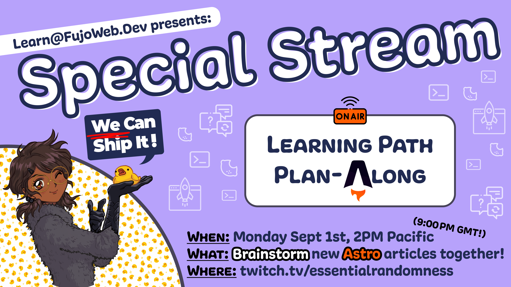

Greetings, _fu(jo|dan|jin)_ and friends,
  It's been a busy busy time in the Fujoverse: plenty of lessons
learned, cool stuff sent out (and preparing to be sent), plus [new learn@
articles](https://learn.fujoweb.dev/)—and how could we forget...the
catboys?

Let's dive right in!

## FujoCoded General Company News

- **Buy Our Love:** We have not one, but [TWO new Patreon
  tiers](https://www.patreon.com/join/fujocoded): **"Supporter Georg”**, because
  someone asked to give us $100, and **“You Fund Me(ette)?”**, because we had to
  make a $50 one too, just for good measure\! We’re running out of names though
  so don’t ask us for $200… unless? 👀 (if you can't [find them on
  Patreon](https://www.patreon.com/join/fujocoded), just keep clicking to the
  right 😜)
- **Lemon-stealing Applause:** Ms Boba’s CitrusCon talk **“Working Together in
  a Dying World”debuted to raving reviews.** If you want to ~~hear~~ read about
  toxic collaboration triangles, and toxic triangular villains, [you can find
  the slides here](https://essentialrandomness.com/working-together) and
  various thematically-related works on AO3, we’re sure.

  

- **That’s How the Cookie Crumbles:** **Our [Fandom
  Cookies](https://store.fujocoded.com/) are all mailed out** and no longer
  threaten to crush Ms Boba in a devastating, if hilarious, avalanche—which
  means people have already been stuffing their mouths with delicious treats\!
  And also the cookies. Thanks to
  [Linky](https://blorbo.social/@linky/114880930048195252) and an Anonymous
  Supporter for the promo pics\!

  

  

- **Here’s Some We Made Earlier:** If that’s not enough, **[the Digital Cookie
  Pack](https://store.fujocoded.com/products/other/fandom-cookies-digital-items-pack)
  is also nearly ready** and we’ve hired
  [Hyena](https://fluffyhyena.neocities.org/), also featured in our promotional
  art, to make some delicious cookie-themed wallpapers using both their
  immensurate visual skills _and_ [our CSS wallpaper
  maker](https://github.com/FujoWebDev/wallpaper-maker).

- **Getting Our Teaching Degree:** Speaking of the [Digital Cookie
  Pack](https://store.fujocoded.com/products/other/fandom-cookies-digital-items-pack)**,**
  **we’re _also_ working on [the promised JS/HTML/CSS
  learn-along](https://store.fujocoded.com/products/other/fandom-cookies-digital-items-pack).**
  It is going steady, but ut taught us that even our multitasking has limits… at
  least when it comes to deadlines. Next time, only a “basic" _or_ “fancy" code
  version in our learn-alongs, not both!

- **Planning for Success:** Q3 planning for Fujoverse is done, in the nick of
  time\! **We’re going to continue hiring more people, and laying the
  foundations to make our work sustainable**, so that Ms Boba no longer wakes up
  in a cold (or hot?) sweat thinking about (teaching) TypeScript. You can read
  [about our NPM articles outsourcing
  below](#FujoCoded-BackerKit-Fulfillment-Progress:-Recent) or simply gaze at
  one of Ms Boba’s humungous project management charts in equal awe and fear\!

  

  If you’d like to be confronted by one of those monstrosities (and paid for
  your service), [drop your card in the hiring section below](#we-are-hiring)!

## FujoCoded Backerkit Update

### FujoCoded BackerKit Fulfillment Progress: Recent

- **NPMployees:** **We landed our first articles**—that you paid for\!—**written by
  someone _other_ than Ms Boba**, and learned a lot from the process\! Such as
  “_Wow, this stuff costs money_” and “_Huh, other people write differently to me_”.
  Even with these obstacles our hired writers knocked it out of the park. You
  can find the fruits of their labour [in the new “JavaScript beyond the
  Browser” section](https://learn.fujoweb.dev/) of learn@fujoweb.dev\!

  

- **Feeding Frenzy:** We’ve also learned that _holy hell_, **fans tasked with
  “just uploading” new article drafts on our learning site will instead rip
  them apart** like piranhas on a cow, and rebuild them better like… piranha
  scientists on a cyborg cow. Unlike this simile, the final articles came out
  great\! Next time, we’ll save time and effort by _intentionally_ channeling
  this energy, perhaps into some kind of prose-editing FujoBeam.

- **Barely Beginners:** We also got some great feedback about our terminology:
  turns out a lotta people read “beginners” to mean “Starting from scratch”
  rather than our “Ankle-deep and wanting more”. With this in mind, **we’re gonna
  work on improving our messaging for learn@ and beyond**, so we can
  fujo-snipe our main targets into coding forces of ~~nature~~ yaoi\!

- **A Need for NPM:** Finally, our new content had a bit of a mid-creation
  crisis—**the NPM articles are useful, but it’s not always clear where they
  _fit_,** especially to ~~beginners~~ hobbyists. Next up, we’re taking them out
  to buy a motorbike and hooking them up with Astro, so that together you _all_
  can shoot for the stars. [More below\!](#fujocoded-backerkit-fulfillment-progress-future)

### FujoCoded BackerKit Fulfillment Progress: Future

- **Dressing to Impress:** **One of our writers**,
  [Rie](https://notavodkashot.carrd.co/), **gave us some excellent
  post-article-delivery advice**, like how to do “better storytelling” and
  "clearer content guidelines”, which they claim are “important”. Under their
  guidance, we’ll be evolving the style guide in preparation for our next learn@
  releases\!

- **Shooting for the Stars:** As mentioned, we plan to showcase NPM’s learning
  value by tying it closer to Astro like it’s a 3-legged race\! We’re still
  working on the details, but we’ll keep you all updated—nay, _involved_: **next
  week, we’ll be gathering feedback _live_ from _you_ on stream\*\!** Join our
  “Learning Path Plan-Along (Astro edition)” [Twitch
  stream](http://twitch.tv/essentialrandomness) on Monday, September 1st, 2PM
  Pacific!

  

## The Fujoshi Guide to Web Development

### Recent Progress on the FujoGuide

- **Git Ready for Badges:** We’ve had one, yes, but what about a _second_ badge?
  **Coming in hot with a cute new badge for our lovely backers**, courtesy of
  [touchofstatic](https://github.com/touchofstatic). Just like the old badge
  backers will find it in their rewards folder; but unlike [the old one](#whats-next-for-fujoguide), this
  will remain a Kickstarter Exclusive! (Lost your rewards folder?
  Check out the email to follow\!)

  

- **Catboy Convergence:** The new catboys are here\! Having gone through the
  final adoption process for ‘em, **[Gitea](https://about.gitea.com/) and
  [Forgejo](https://forgejo.org/)'s pedigree certificates**—their
  behind-the-scenes files, that is—**will soon be in our Kickstarter backers and
  [Patreon $upporters](https://www.patreon.com/fujocoded)’s inboxes**, right
  after you read this\! Hopefully fully vaccinated and neutered, though they’re
  not happy about that last one. Huge thanks to
  [brokemycrown](https://www.fujoweb.dev/team/brokemycrown) for another two hot
  catboys hot off the art presses, they look great\!

  

- **Teasing Tails:** No money for the behind the scenes? Have a tease: **twins
  Gitea and Forgejo used to be so close you could hardly tell them apart.**
  Unfortunately, since [Gitea](https://about.gitea.com/) (left) created his own
  company—whether to chase sustainability (he says), or to seek big daddy
  Microsoft’s approval ([Forgejo](https://forgejo.org/) says)—he’s now become
  _insufferable_. He even started wearing a beret\! Yet, in their own way, they
  both still strive to bring independent Version Control to the masses, even if
  they squabble like…well, two cat(boy)s.

- **Pre-sale and Pre-view:** This month, we updated our store to support selling
  unlisted, direct-link-only items (👀), which means **FujoGuide Issue 1 Preview**
  (the one folks got in their Kickstarter rewards) **is now on sale… if you know
  where to get it.** We already had our first chances to give it out, so we can
  confirm the sales are sailing, with a few bugs still to squash\!

  

### What's Next for FujoGuide

- **Ye Olde Badge:** And speaking of FujoGuide sales. Remember the old Git badge
  (👇👀) we sent our backers? With the new [_Kickstarter exclusive_
  one](#recent-progress-on-the-fujoguide) _finally_ ready,it’s time to share
  that one more broadly with everyone who buys (and bought) our Git zine\! **If
  you’re among the current acquirers, you’ll soon get an email with your
  updated zine, badge included.** And if you’re among our backers… go check back
  in your rewards folder, it’s already there\!  
  

- **The Beta-verse:** While we’ve had to channel all our teaching energy into
  [the Fandom Cookies
  Learn-along](https://store.fujocoded.com/products/other/fandom-cookies-digital-items-pack),
  **we pinky-promise to have an update on the GitHub Zine beta by the next
  newsletter.** Thank you everyone for your patience—in the meantime,
  look forward to getting the new badges and character sheets into your hands\!

## Around the FujoVerse

### In the press

- **~~Seeing~~ Talking Double:** Hot off the tails of [this year's Citrus Con
  talk](#fujocoded-general-company-news), Ms Boba jumped straight into the
  [DashCon 2](https://www.dashcontwo.com/) ball pit to give last year’s again.
  **Check out [the “Rebuilding Community on the FujoWeb”
  re-recording](https://www.youtube.com/watch?v=glAHIjtmYmk)** to hear about how
  shit’s, well, _still pretty fucked_ in the “running social media platforms”
  world.
- **Writing Triple:** If _watching_ is not your cup of (git)tea, **the third and
  last part of “Rebuilding Community on the FujoWeb” is also all yours for
  _reading_\!** [Continue from where you left
  off](https://www.essentialrandomness.com/posts/rebuilding-community-on-the-web/part-3)
  to learn more about the journey ahead, or [start back from the
  beginning](https://www.essentialrandomness.com/posts/rebuilding-community-on-the-web/part-1)
  to understand how we got here and how we (might) get out.
- **Boards-Love Cameo:** Our FujoBoards got even more web-famous this month
  after they were featured on [esteemed-BL-manga-publisher Seven Seas
  Entertainment](https://x.com/fujoc0ded/status/1952809772983755012)’s own Twitter
  account. As they say, "Senpai noticed
  us~" (and ~~stole our hearts~~ [bought our boards](https://fujoboard.com/)).

  

### In the (git)hub

- **Plugged In:** A new Astro ~~plugin~~ Integration has landed\!
  **[`@fujocoded/astro-dev-only` lets you hide any page of your Astro
  website](https://github.com/FujoWebDev/fujocoded-plugins/tree/main/astro-dev-only)
  from the prying eyes of visitors**, making them only available during
  development\! Big power, big JavaScript crimes.
- **Wall Pa(m)pered:** Our [“HTML\&CSS Wallpaper
  Maker”](https://github.com/FujoWebDev/wallpaper-maker) got an upgrade\! The
  Fortune Cookies wallpapers ([soon in our digital
  pack!](https://store.fujocoded.com/products/other/fandom-cookies-digital-items-pack))
  dusted off our memory of its inner workings, which means we’ve
  released our “internal upgrades” for everyone to enjoy. **_You too_ can now
  create HTML snippets to reuse multiple wallpapers.** What better way to practice
  your HTML & CSS? Make some wallpapers, and share them with us on socials!
- **Long Staffed:** [`@bobaboard/ao3.js` got a _tiny bit_ more
  powerful](https://github.com/FujoWebDev/AO3.js) thanks to _a_ short-but-mighty
  external contribution: **[our friend
  Gingerchew](https://queer.party/@gingerchew)—_thank you\!_—added built-in
  support for short “ao3.org” links\!** If you wish to follow in their
  footsteps, we'd love to help you [open or grab an
  issue](https://github.com/FujoWebDev/AO3.js/issues), or be a “pinch-hitter”
  for [an open
  Pull Request](https://github.com/FujoWebDev/AO3.js/pulls?q=is:open+is:pr+label:%22%E2%9A%BE+Needs+Pinch+Hitter%22)**.**
  All skill levels are welcome\!

### Ms Boba Streaming Schedule

To knock [our ATproto
guestbook](https://github.com/fujowebdev/lexicon-guestbook) ~~up~~ out in record
time, **we’re back (with a vengeance) to our double-feature Monday+Thursdays
schedule**. As always, join our coding adventures [on
Twitch at 3PM Pacific](https://www.twitch.tv/essentialrandomness)_...ish._ We may be on
air more often, but not always more _on time_ 🙇‍♀️!

More importantly: the increased schedule once again leaves us space for some
_special edition_ streams. This time, **we’re _inviting_ everyone to come
brainstorm the future [Astro section](https://astro.build/) of our [learn@
website](https://learn.fujoweb.dev/) with us**!

What should our new articles cover? How will they intersect with our NPM ones?
Let's _ALL_ find out during our [“Learning Path Plan-Along (Astro edition)” Twitch
stream](http://twitch.tv/essentialrandomness) on Monday, September 1st, 2PM
Pacific!

## We Are Hiring!

It remains true, month after month: **writers, coders, and artists are _always_
welcome to submit their business cards via our [Business Cards Drop-off
Forms](https://fujocoded.com/hiring)**. When hiring opportunities arise, we always pull these contacts up as we search for the right candidates!

Speaking of which, welcome to the special contracting opportunities we're hiring
for at this time 👇

- **💰Digital Relea$e:** Are you a hype-generating machine? Do you know how to
  make online dwellers' hearts go _doki doki_? **Help us create a release plan
  for [our upcoming Digital
  Pack](https://store.fujocoded.com/products/other/fandom-cookies-digital-items-pack)!**
  While you won't have to do _everything_ yourself, we need your help thinking
  through this launch, and planning (maybe _even writing_)
  content that gets all our supporters to share _our joy_...and, hopefully,
  _their money_.
- **`💰WRITEME.md`:** Do you like writing? Do you like (even just some) coding?
  Do you love the idea of empowering others to, as they say, _"supercharge"
  their coding powers_ with pre-made libraries or integrations? **Come write
  [the `README.md`
  files](https://docs.github.com/en/repositories/managing-your-repositorys-settings-and-features/customizing-your-repository/about-readmes)
  for our repositories, and tell others how to put our code to their own use!**
  First step: [our WIP `@fujocoded/authproto`
  integration](https://github.com/FujoWebDev/fujocoded-plugins/tree/main/astro-authproto),
  which adds ATproto authentication to _any_ Astro site and lets visitors log
  in.

To express interest for these short-term opportunities, **use our [**expedited** "Hiring Right Now" form](https://forms.gle/xQtKhiT9E1KEsn9c6) to
let us know you're <u>currently available</u>, and a good match for the position.** If you don't quite
fit (and have filled out [our usual forms](https://fujocoded.com/hiring)),
we'll still look over those records to find additional candidates.

## That's all, folks!

And with that, our August [update] is finished! See you next edition for more adventures
together!

Love,  The FujoCoded Team _(A Confluence of Calamities)_
