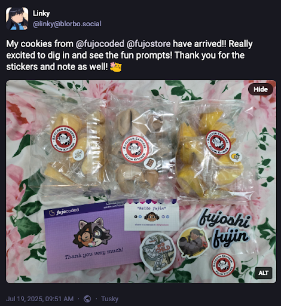
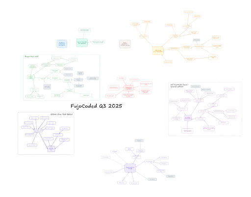
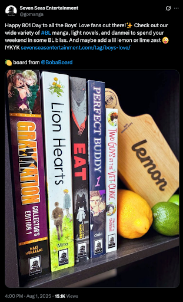

Greetings, fujoshi, fudanshi, fujin, and friends,
This month, we bring you more news than a week of doomscrolling - convention talks, cookies, learning, and paddles!

It's been a busy busy time in the Fujoverse, plenty of lessons learned, cool stuff to send out, and articles written. 

See below for more details!

## FujoCoded General Company News

- **Buy Our Love:** We have not one, but TWO new [Patreon](https://www.patreon.com/c/fujocoded%20) tiers: "Supporter Georg”, because someone asked to give $100, and “You Fund Me(ette)?”, because we had to make a $50 one too, just for good measure\! We’re running out of names though so don’t ask us for $200… unless? 👀  
- **Lemon-stealing Applause \#1:** Ms Boba’s CitrusCon talk “Working Together in a Dying World” debuted to raving reviews. If you want to ~~hear~~ read about toxic collaboration triangles, and toxic triangular villains, you can find the slides here (XXX), and various related works on AO3, we’re sure.  TODO: preview image

- **Encore:** Hot off of that, Ms Boba then jumped into the DashCon 2 ball pit to share her talk from last year again, this time with added testimonial from the Cohost runner about how shit’s, well, still pretty fucked in the “running social media platforms” world…and in her schedule. 

- **That’s How the Cookie Crumbles:** Our [Fandom Cookies](https://store.fujocoded.com/) are all mailed out and no longer threaten to crush Ms Boba in a devastating, if hilarious, avalanche—which means people have already been stuffing their mouths with delicious treats\! And also the cookies. Thanks to [Linky](https://blorbo.social/@linky/114880930048195252) and an Anonymous Supporter for the promo pics\!   

- **Here’s Some We Made Earlier:** If that’s not enough, [the Digital Cookie Pack](https://store.fujocoded.com/products/other/fandom-cookies-digital-items-pack) is also nearly ready and we’ve hired Hyena, also featured in our campaign art, to make some delicious cookie-themed wallpapers using both their immensurate visual skills *and* our [CSS wallpaper maker](https://github.com/FujoWebDev/wallpaper-maker).

- **Getting Our Teaching Degree:** Speaking of the [Digital Cookie Pack](https://store.fujocoded.com/products/other/fandom-cookies-digital-items-pack)**,** we’re *also* working on the JS/HTML/CSS learn-along which is going steady, but taught us that even our multitasking has limits… at least when it comes to deadlines. Next time, only “basic” *or* “fancy” code in our learn-alongs, not both\!

- **Planning for Success:** Q3 planning for Fujoverse is done, in the nick of time\! We’re going to continue hiring more people, and laying the foundations to keep that sustainable, so that Ms Boba no longer wakes up in a cold (or hot?) sweat thinking about TypeScript. You can read about the NPM outsourcing [below](#FujoCoded-BackerKit-Fulfillment-Progress:-Recent) or simply gaze at one of Ms Boba’s humungous project management charts in equal awe and fear\! If you’d like to be confronted by one of those monstrosities (and paid for your service), drop a card below\! 

## FujoCoded Backerkit Update

### FujoCoded BackerKit Fulfillment Progress: Recent

- **NPMployees:** We landed our first articles—that you paid for\!—written by someone *other* than Ms Boba and learned a lot from the process\! Such as “Wow, this stuff costs money” and “Huh, other people write differently to me”. Even with these obstacles our hired writers knocked it out of the park. You can find the fruits of their labour [in the newest “JavaScript beyond the Browser” section](https://learn.fujoweb.dev/) of learn@fujoweb.dev\! 

- **Feeding Frenzy:** We’ve also learned that *holy hell*, fans tasked with “simply uploading” new article drafts on our learning site will instead rip them apart like piranhas on a cow, and rebuild them better like… piranha scientists on a cyborg cow. Unlike this simile, the final articles came out great\! Next time, we’ll save time and effort by *intentionally* channeling this energy, perhaps into some kind of FujoBeam.

- **Barely Beginners:** We also got some great feedback about our terminology: turns out a lotta people read “beginners” to mean “Starting from scratch” rather than our “ankle-deep and wanting more”. With this in mind, we’re gonna look over our messaging for learn@ and beyond, so we can fujo-snipe our main targets into coding forces of ~~nature~~ yaoi\!  

- **A Need for NPM:** Finally, our NPM articles had a bit of a mid-creation crisis—they’re useful, but it’s not always obvious why, especially to ~~beginners~~ *hobbyists*. Next month, we’re taking them out to buy a motorbike and hook them up with Astro so that *you* can shoot for the stars. More below\! 

### FujoCoded BackerKit Fulfillment Progress: Future

- **Dressing to Impress:** One of our article writers, [Rie](https://notavodkashot.carrd.co/), gave us some excellent post-delivery advice like how to do “better storytelling” and “stricter content guidelines”, which they claim are “important”. We’ll be evolving the style guide in preparation for our next learn@ releases\! 

- **Shooting for the Stars:** To showcase NPM’s learning value, we’re gonna be tying our NPM articles closer to Astro like it’s a 3-legged race\! We’re still figuring out how, but we’ll keep you all updated—nay, *involved*: we’ll be gathering feedback *live* from *you* on stream*\!* Join our “learn@ planning, Astro edition” [Twitch stream](http://twitch.tv/essentialrandomness) on \[TBD\]\!  

## Around the FujoVerse

### In the press

- **~~Seeing~~ Talking Double:** We had one talk, yes, but what about *second talk*? Straight off the tails of her newest Citrus Con talk, Ms Boba jumped straight into the DashCon 2 ball pit to give last year’s again. Check out the new “Rebuilding Community on the FujoWeb” recording to hear about how shit’s, well, *still pretty fucked* in the “running social media platforms” world. Now featuring Cohost’s runner's own testimonial. 

- **Writing Triple:** If *watching* is not your cup of (git)tea, the third and last part of “Rebuilding Community on the FujoWeb” is also all yours for *reading*\! Continue from where you left off to learn more about the journey ahead of us, or start back from the beginning to see the full picture.

- **Boards Love Cameo:** Our FujoBoards got even more web-famous this month after they were featured on [esteemed-BL-manga-publisher Seven Seas Entertainment’s own Twitter account](https://x.com/fujoc0ded/status/1952809772983755012). \[TODO\]

### In the (git)hub

- **Plugged In:** a [new Astro ~~plugin~~ Integration](https://github.com/FujoWebDev/fujocoded-plugins/tree/main/astro-dev-only) has landed\! `@fujocoded/astro-dev-only` lets you hide any page of your Astro sites from the prying eyes of visitors, making them only available during development\! Big power, big JavaScript crimes.  
- **Wall Pa(m)pered:** our [“HTML\&CSS Wallpaper Maker”](https://github.com/FujoWebDev/wallpaper-maker) got an upgrade\! With our memory of its inner workings dusted off for our Fortune Cookies wallpapers (soon in our digital pack\!), we’ve released our “internal upgrades” for everyone to enjoy. Now that *you too* can import HTML snippets across multiple wallpapers, what better way to learn some HTML & CSS than by making some?  
- **Long Staffed:** `@bobaboard/ao3.js` got evena *tiny bit* more powerful thanks to *a* short-but-mighty external contribution: our friend Gingerchew—*thank you\!*—added built-in support for short “ao3.org” links\! Want to help us develop even more features? [Open or grab an issue](https://github.com/FujoWebDev/AO3.js/), or be a “pinch-hitter” for [one of our open PRs](https://github.com/FujoWebDev/AO3.js/pulls?q=is:open+is:pr+label:%22%E2%9A%BE+Needs+Pinch+Hitter%22)**.** All skill levels are welcome\!

### Ms Boba Streaming Schedule

After back-to-back cons stopped us from streaming last month, we’re coming back with a vengeance and doing a double-feature Monday+Thursdays so that we can knock the guestbook ~~up~~ out in record time. 

In our latest editions, we’ve built a dedicated Astro website for people to see, post on, and even create their guestbooks\! After some light styling, we’ll now tackle important features like content deletion and moderation.

But even more importantly, this increased schedule means we now have space for some *special edition* streams. This month, we’re inviting everyone interested to come discuss and outline together the future “Astro” section of our learn@ website\! What should our new articles cover? How will they intersect with the NPM ones we’re already planning?

Join us on \[date tbd\], and let’s find out together\!

## That's all, folks!

And with that, our August update is finished! See ya next month ([and on
Twitch](https://www.twitch.tv/essentialrandomness)) for more adventures
together!

Love,  The FujoCoded Team _(A Confluence of Calamities)_
