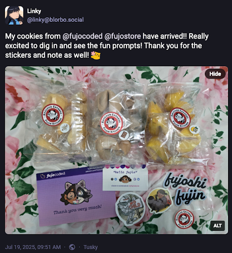
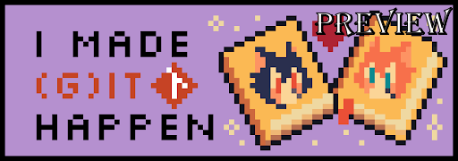
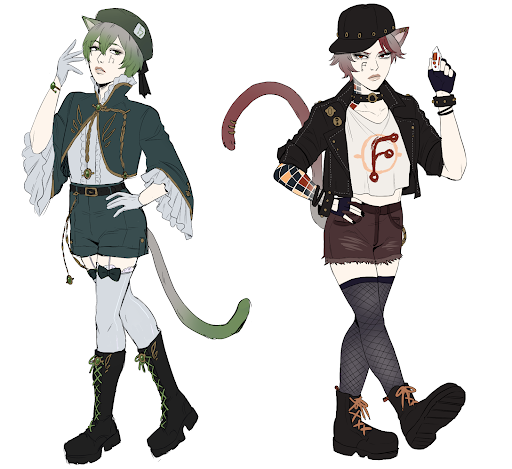
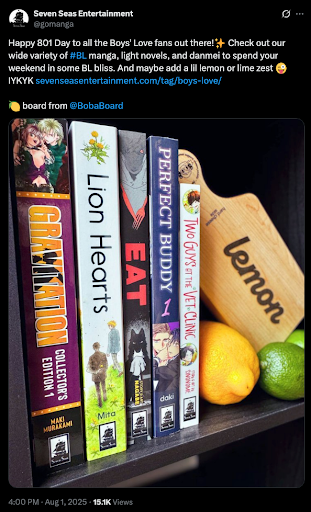

Greetings, fujoshi, fudanshi, fujin, and friends,
This month, we bring you more news than a week of doomscrolling - convention talks, cookies, learning, and paddles!

It's been a busy busy time in the Fujoverse, plenty of lessons learned, cool stuff to send out, and articles written. 

See below for more details!

## FujoCoded General Company News

- **Buy Our Love:** We have not one, but TWO new [Patreon](https://www.patreon.com/c/fujocoded%20) tiers: "Supporter Georg”, because someone asked to give $100, and “You Fund Me(ette)?”, because we had to make a $50 one too, just for good measure\! We’re running out of names though so don’t ask us for $200… unless? 👀  
- **Lemon-stealing Applause \#1:** Ms Boba’s CitrusCon talk “Working Together in a Dying World” debuted to raving reviews. If you want to ~~hear~~ read about toxic collaboration triangles, and toxic triangular villains, you can find the slides here (XXX), and various related works on AO3, we’re sure.  TODO: preview image

- **Encore:** Hot off of that, Ms Boba then jumped into the DashCon 2 ball pit to share her talk from last year again, this time with added testimonial from the Cohost runner about how shit’s, well, still pretty fucked in the “running social media platforms” world…and in her schedule. 

- **That’s How the Cookie Crumbles:** Our [Fandom Cookies](https://store.fujocoded.com/) are all mailed out and no longer threaten to crush Ms Boba in a devastating, if hilarious, avalanche—which means people have already been stuffing their mouths with delicious treats\! And also the cookies. Thanks to [Linky](https://blorbo.social/@linky/114880930048195252) and an Anonymous Supporter for the promo pics\!   

- **Here’s Some We Made Earlier:** If that’s not enough, [the Digital Cookie Pack](https://store.fujocoded.com/products/other/fandom-cookies-digital-items-pack) is also nearly ready and we’ve hired Hyena, also featured in our campaign art, to make some delicious cookie-themed wallpapers using both their immensurate visual skills *and* our [CSS wallpaper maker](https://github.com/FujoWebDev/wallpaper-maker).

- **Getting Our Teaching Degree:** Speaking of the [Digital Cookie Pack](https://store.fujocoded.com/products/other/fandom-cookies-digital-items-pack)**,** we’re *also* working on the JS/HTML/CSS learn-along which is going steady, but taught us that even our multitasking has limits… at least when it comes to deadlines. Next time, only “basic” *or* “fancy” code in our learn-alongs, not both\!

- **Planning for Success:** Q3 planning for Fujoverse is done, in the nick of time\! We’re going to continue hiring more people, and laying the foundations to keep that sustainable, so that Ms Boba no longer wakes up in a cold (or hot?) sweat thinking about TypeScript. You can read about the NPM outsourcing [below](#FujoCoded-BackerKit-Fulfillment-Progress:-Recent) or simply gaze at one of Ms Boba’s humungous project management charts in equal awe and fear\! If you’d like to be confronted by one of those monstrosities (and paid for your service), drop a card below\! 

## The Fujoshi Guide to Web Development

### Recent Progress on the FujoGuide

- **Git Ready for Badges:** We’ve had one, yes, but what about a *second* badge? We’re coming in hot with a cute new badge for our lovely backers\! Just like the old badge you’ll find it in your rewards folder; but unlike the old one, this will remain a Kickstarter Exclusive. (Lost your rewards folder? Check out the email to follow\!)

- **Catboy Convergence:** The new catboys are here\!Having gone through the final adoption process for ‘em, their pedigree certificates will be in our Kickstarter backers and Patreon $upporters’s inboxes right after you read this\! Hopefully fully vaccinated and neutered, though they’re not happy about that last one. Huge thanks to [brokemycrown](https://www.fujoweb.dev/team/brokemycrown) for another two hot catboys hot off the art presses, they look great\!

- **Teasing Tails:** No money for the behind the scenes? Have a tease: twins Gitea and Forgejo used to be so close it was impossible to even tell them apart. Unfortunately, since Gitea (left) created his own for-profit company—whether to chase sustainability (he says), or to seek big daddy Microsoft’s approval (Forgejo says)—he’s now become truly insufferable. He even started wearing a beret\! Yet, they both still strive to bring independent version control to the masses, even if they squabble like…well, two cat(boy)s.

- **Pre-sale and Pre-view:** Behind the scenes, we’ve been updating our store to supportunlisted, direct-link-only items (👀), which means FujoGuide Issue 1 Preview (the one folks got in their Kickstarter rewards) is now be on sale… although exclusively for those who know where to get it. We already had our first chances to give it out, so we can confirm the sales are sailing…with a few bugs to squash\!

- **Ye Olde Badge:** And speaking of sale… Remember the old Git badge (👇👀) we mentioned? With the new *Kickstarter exclusive* one finally ready, as we promised a long time ago, it’s finally time to share this one more broadly with everyone who’s bought our Git zine\! If you’re among the exclusive acquirers, you’ll soon get an email with your updated zine, badge included. And if you’re among our backers… go check back in your rewards folder, it’s already there\!  

### What's Next for FujoGuide 
- **The Beta-verse:** While we’ve been channeling all our teaching energy into the Fandom Cookies Learn-along, we’re shooting to have an update on the GitHub beta by the next newsletter. Thank you everyone for your patience, and we’re looking forward to getting the badges and character sheets into your hands\!

## Around the FujoVerse

### In the press

- **~~Seeing~~ Talking Double:** We had one talk, yes, but what about *second talk*? Straight off the tails of her newest Citrus Con talk, Ms Boba jumped straight into the DashCon 2 ball pit to give last year’s again. Check out the new “Rebuilding Community on the FujoWeb” recording to hear about how shit’s, well, *still pretty fucked* in the “running social media platforms” world. Now featuring Cohost’s runner's own testimonial. 

- **Writing Triple:** If *watching* is not your cup of (git)tea, the third and last part of “Rebuilding Community on the FujoWeb” is also all yours for *reading*\! Continue from where you left off to learn more about the journey ahead of us, or start back from the beginning to see the full picture.

- **Boards Love Cameo:** Our FujoBoards got even more web-famous this month after they were featured on [esteemed-BL-manga-publisher Seven Seas Entertainment’s own Twitter account](https://x.com/fujoc0ded/status/1952809772983755012). \[TODO\]

### In the (git)hub

- **Plugged In:** a [new Astro ~~plugin~~ Integration](https://github.com/FujoWebDev/fujocoded-plugins/tree/main/astro-dev-only) has landed\! `@fujocoded/astro-dev-only` lets you hide any page of your Astro sites from the prying eyes of visitors, making them only available during development\! Big power, big JavaScript crimes.  
- **Wall Pa(m)pered:** our [“HTML\&CSS Wallpaper Maker”](https://github.com/FujoWebDev/wallpaper-maker) got an upgrade\! With our memory of its inner workings dusted off for our Fortune Cookies wallpapers (soon in our digital pack\!), we’ve released our “internal upgrades” for everyone to enjoy. Now that *you too* can import HTML snippets across multiple wallpapers, what better way to learn some HTML & CSS than by making some?  
- **Long Staffed:** `@bobaboard/ao3.js` got evena *tiny bit* more powerful thanks to *a* short-but-mighty external contribution: our friend Gingerchew—*thank you\!*—added built-in support for short “ao3.org” links\! Want to help us develop even more features? [Open or grab an issue](https://github.com/FujoWebDev/AO3.js/), or be a “pinch-hitter” for [one of our open PRs](https://github.com/FujoWebDev/AO3.js/pulls?q=is:open+is:pr+label:%22%E2%9A%BE+Needs+Pinch+Hitter%22)**.** All skill levels are welcome\!

### Ms Boba Streaming Schedule

After back-to-back cons stopped us from streaming last month, we’re coming back with a vengeance and doing a double-feature Monday+Thursdays so that we can knock the guestbook ~~up~~ out in record time. 

In our latest editions, we’ve built a dedicated Astro website for people to see, post on, and even create their guestbooks\! After some light styling, we’ll now tackle important features like content deletion and moderation.

But even more importantly, this increased schedule means we now have space for some *special edition* streams. This month, we’re inviting everyone interested to come discuss and outline together the future “Astro” section of our learn@ website\! What should our new articles cover? How will they intersect with the NPM ones we’re already planning?

Join us on \[date tbd\], and let’s find out together\!

## That's all, folks!

And with that, our August update is finished! See ya next month ([and on
Twitch](https://www.twitch.tv/essentialrandomness)) for more adventures
together!

Love,  The FujoCoded Team _(A Confluence of Calamities)_
