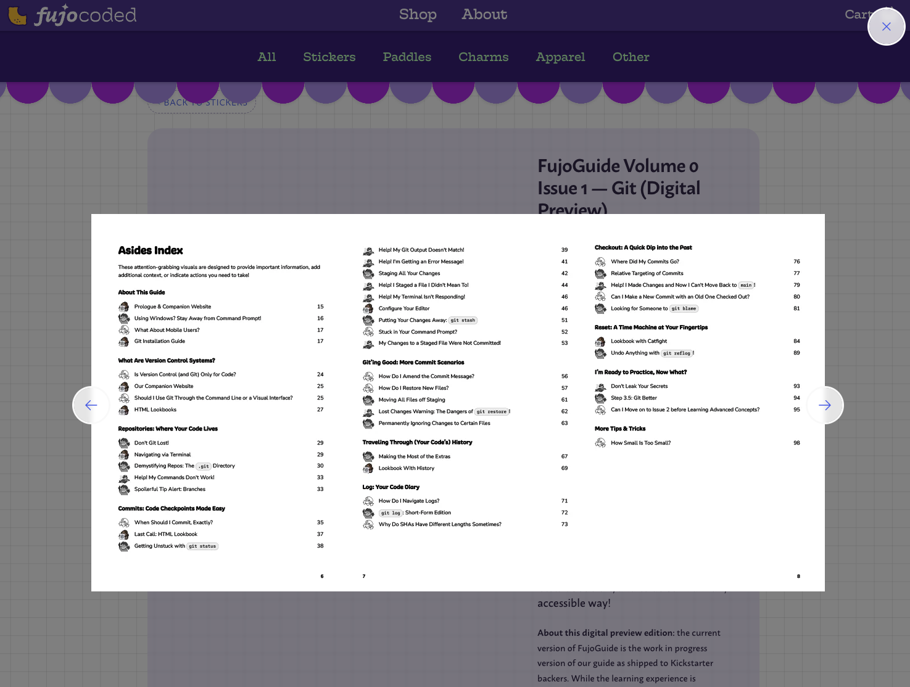
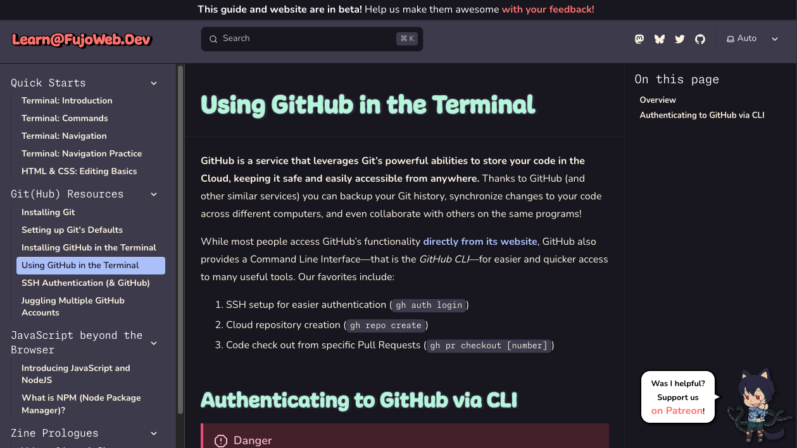

Greetings, _fu(jo|dan|jin)_ and friends,
  End of year celebrations are upon us, and what better way to usher them in than the unique—_and belated_ 🙇—gift of a signature FujoCoded update?

Venture down this edition for the release of our first publicly-buyable teaching product (a one-of-a-kind tour de force that truly stretched our resources), what's next for FujoGuide Issue 2, and the many things happening in the ever-expanding FujoVerse™\!

## FujoCoded General Company News [Omakase]

**Note**: This is a "omakase" selection of our company's updates. Enjoy the full menu [on our website](https://fujocoded.com/updates/25-08-16-sisyphus-rises).

- **Cookies Complete:** The Fandom Cookies digital pack is out at last: **[head to our store _right now_](https://store.fujocoded.com/products/other/fandom-cookies-digital-items-pack) to learn to build your own fortune generator website\!** This pack includes a ton of content, featuring a full set of wallpapers and digital goodies [from fannish artists](https://bsky.app/profile/fujocoded.bsky.social/post/3m724cmhhrk2g), alongside our HTML/CSS/JavaScript learn-along _“with heavily commented code for beginners stepping up”._ And if you buy it _now,_ **you’ll also get a discount for the ✨fancy edition✨** (for future release), which builds upon the regular pack to help you master _\~even fancier\~,_ more advanced CSS, JS, and HTML techniques.

- **Cleaning Up Our ~~Act~~ Mart:** With the digital pack buyers at our doors, we carved up the time—and _adrenaline_—to tidy up [the FujoCoded store](https://store.fujocoded.com/). In record time, we’ve added a ton of missing stuff like card backgrounds that help stickers pop, on-click image magnification (so you can see what you’re buying), and even made it _much, much_ faster to load\! While these changes improve our store for everyday visitors, they've long been in our to-do list
  for the launch of FujoGuide Issue 1—that table of contents would be _hard_ to read otherwise👇👀

## The Fujoshi Guide to Web Development

### Recent Progress on FujoGuide

- **Hyena in the Docs House:** Our _Volume 0 Issue 2 (GitHub)_ beta readers spoke clearly: while Issue 1 dropped ‘em straight into the HTML-dress-up action (_good_), Issue 2 took too long to get to the point, which hurt the experience (_bad_). To fix this, we once again Hired our [Humble, Helpful, Hardworking-Hand, Hyena](https://fujocoded.com/contributors/hyena) to Heroically Herd our Hypertext and Hone our Headlines—that is, to **rewrite the beginning of our Issue 2 as [articles for learn@](https://learn.fujoweb.dev/git/git-settings/)**, and make this catb… erm, _extra content_ a free-for-all. Progress is ongoing!

- **Delivering Digital Demos**: Little-known fact about our digital pack: far from just serving as our probe into today’s “fujin-targeted webdev education” market, **it was also conceived as a test run for the release of FujoGuide Issue 1** (which is currently gnawing at its containment crate as it begs for the sweet release of…well, _release_). But while this _push_ gave us the _push_ to upgrade our shop for digital deliveries, it also _pushed_ our current capacity—that is, it showed us **the need for a more sustainable system for long-running hype campaigns**…a must-solve for next year\!

- **Searching for Iss-_you_ 2:** The re-drafting and re-beta’ing of Issue 2 hit—alas, _unfortunately_, but perhaps _appropriately_—_2_ snags. The first one (now resolved) was Ms Boba’s teaching energy getting _Denial-of-Service_’d by dual-wielding the digital learn-along release and the hand-off of learn@ articles to new writers. The second one (still pending) is that one of our longest-time friends, collaborators, and in this case _corral-er of beta readers_ had to suddenly step back for personal reasons. So as they say, dear readers, _the search is on_: are you—_yes, you\!_—willing to use your Version Control knowledge to help our _betas_ safely take on a treacherous _alpha_ (our _GitHub zine)_? Let us know [in the "collaborate with us" section below](#collaborate-with-us)\!

### What’s Next for FujoGuide

- **No Dodging this Draft:** With the new year rising, we’ll unwrap ourselves from other predicaments and re-wrap our focus around the coordination of Issue 2 Beta \#2—this means both wrapping up the second draft, and unwrapping a shiny, new wrangler for our betas. The holiday haze may slow things down, but we don’t expect the search to take long: we _do run_ a community full of the most helpful and generous coders in fandom, after all\! Once a coordinator is found, however, we still need to fit a lot of hands, heads, and schedules together, and give them enough time to go through the guide (and feedback) at a comfortable pace. We’ll keep you up to date on our socials\!

- **Eyes on the Prize:** We’ve [recently answered](https://www.kickstarter.com/projects/essential-randomness/the-fujoshi-guide-to-web-development/comments) a question about the longer than planned production for this FujoGuide Kickstarter campaign. If you’ve been feeling a little lost, we hope it’ll explain why we _broadened_ our educational strategy before digging _deeper_ into the delivery of these zines, and how we converged on two longer but more effective books. From the bottom of our hearts: _thank you_—not only for your patience and support, but for giving us the space to tackle webdev education in the way we believe is most effective. Rest assured: we _ourselves_ cannot wait to put these zines into your hands, and we’ll make it our priority throughout 2026\. Onwards, and (as always) beyond\!

## Intermission — A Word _to_ our $ponsors

This update (and our ongoing work) is brought to you by our lovely Patrons\! Couldn’t keep this running without y’all—raccoons need _so much_ food, and don’t even get us started on their _unquenchable thirst for doujinshi_.

If you’ve not already boarded our _ship_, [jump on our Patreon now](https://www.patreon.com/c/fujocoded)\! Tiers start at $3/month, and give you access to coupons and—see our FujoStore highlights below 👀—priority access to discounted or limited-edition merchandise. **You’ll soon even be able to showcase your blorbo [on a big wall](https://bobaboard.com/blorbos-wall-2022)\!**

**Did you know?** Studies show [our Patrons](https://www.patreon.com/c/fujocoded) are 30% more likely to receive long in-depth fanfiction of their rarepairs _(it’s true, we swear)_\!

## Around the FujoVerse

### In the Git(hub)

- **Autorelease of Our Own:** As the FujoVerse™ grows, so must our ability to keep up with its pace—which means we’ve started adding _autorelease_ to our libraries\! This process automatically keeps track of code changes, builds a list of new features, and lets us quickly release new versions into the wild. You can witness our first such release on `@fujocoded/ao3.js` (formerly `@bobaboard/ao3.js`). Among the latest features: tag search, fetching work content, non-AO3 archives support, and download URLs\!

- **Astrolabe’s Blasting Off (Again):** Long-time friends may remember Astrolabe, the “universal rich text editor for multi-platform content” we’ve been chipping away at since, well…_almost_ our origins\! Now, with our ATproto connections bemoaning the need for something Astrolabe-shaped, we’re once again set on making “_fetch”_ happen: Ms Boba has been slowly publishing her private plugins, polishing the Astrolabe repo (check out the [new `README`](https://github.com/FujoWebDev/astrolabe) and [latest Storybook](https://astrolabe-editor.netlify.app/?path=/story/adapters-starter-bluesky--link-and-underline)), upgrading libraries to the latest version, and experimenting with loading posts from other socials ([like Leaflet](https://astrolabe-editor.netlify.app/?path=/story/adapters-starter-leaflet-from--base-lexicon)) or [decentralized ATproto emoji](https://astrolabe-editor.netlify.app/?path=/story/astrolabe-emoji--editable-multiple-sets%20). Alongside her, fellow BobaBoard Builders Bubble member Sel has been working on making Spoilers accessible to screen readers as he familiarizes himself with the codebase. Want to join ‘em? Read on 👀👇

- **Join the Cult:** What’s better than us adding new functionality to our open source projects? Helping _you_—yes you\!—do the same\! The BobaBoard Builders Bubble recently banded together to open contributor-friendly issues for both [AO3.js](https://github.com/FujoWebDev/ao3.js/issues) and [Astrolabe](https://github.com/FujoWebDev/astrolabe/issues), so people like _you_—yes you\!—can come show (or learn) how it’s done\! So look around, swing by, throw some code at the wall, and come ask help if lost\! These’ll look great on your resume, portfolio, _and_ Hinge profile, we swear.

## FujoStore Highlights: Restocks, Sales, and Limited-Time Offers

Are you up smut’s creek without a paddle? If you’re on our [Patreon](https://www.patreon.com/fujocoded), we can fix that\! Whilst scavenging for snacks, loose change, and good ol’ Christmas ornaments, Ms Boba found a bunch of the Fujoboard seconds, which means…

**…all [our Patreon $upporters](https://www.patreon.com/fujocoded) are cordially invited to [FujoCoded’s First Garage Sale](https://www.patreon.com/posts/cybermonday-ale-144797229)\!** These back-of-the-closet paddles may have small flaws (such as scratches, nicks, and prominent wood patterns), but are still a classy and refined choice for your kitchen _and_ bedroom needs\! **They’re up to $20 (+ 20% $upporters discount) off**, so get them whilst they’re hot\!

Our stock includes:

- Hime boards stamped with the vintage BobaBoard logo—$10 off\!
- Utterly unique Hime, only slightly scuffed, with minor marks, colour difference, or wood grain—$20 off\!
- Chibi boards, for those of you who aren’t size queens (hey, we don’t judge)—$15 off\!

For a mere $5 more, you can even get some engraved with any of our available wordings—including the sold out ones\! See our store for [the full list](https://store.fujocoded.com/products/paddles), and **[become a Patreon subscriber today](https://www.patreon.com/fujocoded) to access both the Garage Sale _AND_ the traditional store-wide discount.** Not to mention, help us pay people to...

## Collaborate with Us\!

Welcome to the special opportunities we’re recruiting or hiring for at this time 👇 As the new year dawns, we’ll be looking to start it on the right foot with a recurring theme: _coordination_ (of volunteers), _coordination_ (of beta readers), and _coordination_ (of tasks)\! Without further ado, check out our volunteer positions (🙏) or head straight to our paid one (💰).

- **\[🙏\] Who’ll Wrangle the Wranglers?:** Our origin project, [BobaBoard](https://bobaboard.com/), is **looking for a “Volunteer Wranglers” coordinator**\! Do you have experience recruiting, organizing, and directing volunteers? Are you excited by the meta-challenge of recruiting, organizing, and directing the volunteers who’ll tackle this alongside you? And most importantly—are you willing to do what’s needed to get _fandom people_ working together in pursuit of a better fandom web? Let us know by filling our Volunteers Coordinator application form.
- **\[🙏\] Betas seek Alpha:** FujoGuide is **looking for a beta readers coordinator**\! The task, for those who choose to accept it, is to sit patiently in a Discord group DMs with other 6-7 fannish beginners as they brave our GitHub issue of FujoGuide and (with your guidance) surface unscathed\! You don’t need deep expertise of GitHub to take on this challenge, just be familiar enough with branching, merging, and the pull request process to help people get unstuck. Ideally, we’d like to keep this a volunteer position as it’s traditionally been, but we’d be happy to barter zines, knowledge, or other merch for payment in kind\! DM us or write us at [contacts@fujocoded.com](mailto:contacts@fujocoded.com) to apply.
- **\[💰\] Technical ~~Project~~ Procyon Manager:** Sun Tzu said, “_if you know not yourself, \[...\] you will lose half your battles_”. Luckily, we don’t just _know_ our weaknesses, we know how to _fix_ them. So we’ll be starting 2026 **getting Ms Boba some Project Management ~~emotional~~ support**: have experience wrangling milestones in legible dashboards? love pestering (and guiding\!) people who owe deliverables? Apply here and come help FujoCoded move away from project charts only Ms Boba can read, and free her brain from the woes of keeping folks on track\! This is a temporary, part-time position to help us regroup and set up a working system.

## That’s All, Fujin\!

Phew, what a journey\! Thank _you_ for reading (_or skimming_) all the way down.

We can't wait to see you in the next year (and newsletter), with ~~even
more~~ _a moderate quantity of new_ updates. Since not quite as much time will pass—we
pinkie swear!—we _hope_ the update might will look thinner, but not for that less
meaty.

As always, _quality over quantity, mind over matter, seme over
uke._

Happy 2026,  
Your friends @ FujoCoded LLC
