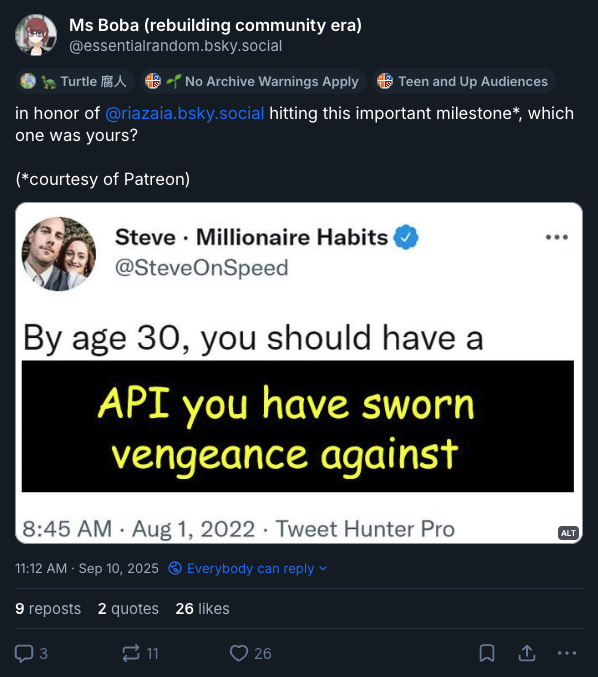

Greetings, _fu(jo|dan|jin)_ and friends,
  End of year celebrations are upon us, and what better way to usher them in than the unique—_and belated_ 🙇—gift of a signature FujoCoded update?

Venture down this edition for the release of our first publicly-buyable teaching product (a one-of-a-kind tour de force that truly stretched our resources), the steadfast progress on taking the [production of learn@ content](https://learn.fujoweb.dev/) off Ms Boba's tired shoulders, and the many things happening in the ever-expanding FujoVerse™\!

## FujoCoded General Company News

- **Cookies Complete:** The Fandom Cookies digital pack is out at last: **[head to our store _right now_](https://store.fujocoded.com/products/other/fandom-cookies-digital-items-pack) to learn to build your own fortune generator website\!** This pack includes a ton of content, featuring a full set of wallpapers and digital goodies [from fannish artists](https://bsky.app/profile/fujocoded.bsky.social/post/3m724cmhhrk2g), alongside our HTML/CSS/JavaScript learn-along _“with heavily commented code for beginners stepping up”._ And if you buy it _now,_ **you’ll also get a discount for the ✨fancy edition✨** (for future release), which builds upon the regular pack to help you master _\~even fancier\~,_ more advanced CSS, JS, and HTML techniques.

- **Executive Release:** In the spirit of _baiting two seme with one uke_, our Digital Pack release did not just deliver _over 120_ of them, “freebies” included, **it _also_ showed us how we’d fare with a prolonged release campaign\!** Let’s just say with only one Ms Boba and many, many cookies (and threads), we did have to [crowdsource our executive function](https://bsky.app/profile/fujocoded.bsky.social/post/3m4eiw4xxh22u). Thankfully, we also engaged the socials-wrangling help of [queercatboy](http://fujocoded.com/contributors/gqueercatboy) and Elendraug. Next launch campaign challenge… FujoGuide Issue 1? 👀

- **Documentation Depot:** Behold, our latest (a)live-but-in-progress site, [community.fujocoded.com](https://community.fujocoded.com/) (or “_community@_”, for friends)\! Here we’ll stock up all of our **resources on community building and governance**, set up more **central documentation for our libraries**, and share some of the **internal FujoCoded know-hows** for everyone's eyes. Huge thanks to our friend [Gingerchew](https://github.com/gingerchew) for helping us style it with some fujo-flair\!

- **Very Important Progress:** The exclusive lounge for our Big Money spenders—that is, our $upporters area—is coming together nicely. The VIPs who [get past the velvet rope](https://patreon.com/fujocoded) will soon **get access to secret shops, discount codes, and the ability to emblazon their blorbo on a wall for all to see** (_old-timers may remember BobaBoard’s [“Volunteers Blorbo Wall”](https://bobaboard.com/blorbos-wall-2022)_). [Touchofstatic](https://github.com/touchofstatic), our webdev for hire did a great job giving the site a first coat of style and code, while [our long-term contractor Ria](https://fujocoded.com/contributors/ria) pulled Stripe PayPal, and Patreon’s heads out of their collective ~~asses~~ APIs to set up the user database.

- **Cleaning Up Our ~~Act~~ Mart:** With the digital pack buyers at our doors, **we carved up the time—and _adrenaline_—to tidy up [the FujoCoded store](https://store.fujocoded.com/).** In record time, we’ve added a ton of missing stuff like card backgrounds that help stickers pop, on-click image magnification (so you can see what you’re buying), and even made it _much, much_ faster to load\! For the animated Disney-style montage of the raccoon(girl)s working their cleaning magic, throw us a few hundred bucks and we’ll see what we can do.

- **Software Shippers:** …and finally, we’ve kept on shipping both blorbos and software libraries\! You’ll find the in-depth update, covering everything from more [AO3.js functionality](https://github.com/FujoWebDev/AO3.js) to the ([re)rise of Astrolabe](https://github.com/FujoWebDev/astrolabe) in the [“in the Git(hub)” section below](#in-the-github). For now, simply join us in cheering our hired hand [Haetae](https://bsky.app/profile/haetae.cozy.fan) who braved Authproto’s code to give ~~it~~ us a README, a folder of usage examples, and a whole series of bug discoveries\!

## FujoCoded Backerkit Update

> **Editor's Note:** BackerKit funds helped launch learn@ by funding our Terminal and NPM series, so we'll be officially including all progress here from here on out\!

### FujoCoded BackerKit Fulfillment Progress: Recent

- **Workshopping Writers:** Our [friend and article writer Rie](https://fujocoded.com/contributors/rie) took [our existing learn@ style guide](https://community.fujocoded.com/fujowebdev/) into their own hands (and wisdom). After giving our existing guidelines a very-needed coat of polish and clarity, **they used their experience to concoct a better article writing AND review process**—all this so we can spread our (free) knowledge faster and more sustainably\! If that was not enough, they’re now test-driving this same process, **guiding a kind volunteer in reviewing the [Terminal series you funded](https://learn.fujoweb.dev/quickstarts/terminal-quickstart/) (🙏)** and upgrading it to fit our latest guidelines.

- **Amicable Divorce:** Ms Boba’s been breaking up marriages again, this time **splitting up our [NPM articles](https://learn.fujoweb.dev/npm/javascript-beyond-websites-nodejs) into more focused and approachable (not to mention less scary) chunks.** Hand-on exercises—like [Running NodeJS programs](https://learn.fujoweb.dev/npm/your-first-node-program/) and [Learn and Practice NPM](https://learn.fujoweb.dev/npm/npm-in-practice/)—are now cozily settled in their single-occupancy home(page)s, so you can head directly to your preferred learning avenue, or more easily link your friends to the exact skills they seek.

- **Shoot for the Stars**: Behold the outline of our [Astro learning path](https://leaflet.pub/117c41f5-52a5-4a9d-9b42-f8d4c3a6c6fe)\! As the [last newsletter](https://fujocoded.com/updates/25-08-16-sisyphus-rises) foretold, the collective hive-mind gathered forth in our [Astro stream](https://www.twitch.tv/videos/2556015846) to ponder the missing pieces in the existing Astro docs. The verdict? While they’re excellent for people starting a website from scratch, **Astro's lack guidance for those wishing to upgrade their handcrafted sites—a significant portion of our own target audience\!** We have, _alas_, not yet placed this “jump on the Astro rocket without leaving your site behind” series in our schedule, but we’re eager to start as our current articles (and other assorted obligations) wind down.

### FujoCoded BackerKit Fulfillment Progress: Future

- **NVM Extras:** We’ve had your first batch of NPM articles, yes, but what about a _second batch_? In the very first partnership of its kind, **the BobaBoard Docs Bubble**—aka, _sociocratic circle_—**collectively drafted an installation guide for NVM**—aka, _Node Version Manager_—which is our recommended avenue of getting access to NodeJS—aka, [_JavaScript but outside the Browser_](https://learn.fujoweb.dev/npm/javascript-beyond-websites-nodejs/). Next up, we’ll add this guide to learn@ to **help people install NodeJS _the proper way_ by <u>not</u> installing it**. A huge thank you to “The Docs”, our <em>doc</em>-torly bunch who all prefer the cover of anonymity, for their much better write-up on this complicated relationship\!

- **Governance and You:** With [community@](https://community.fujocoded.com/) up and ready, we can **start filling it up with some currently-internal guides on [Sociocracy](https://www.sociocracyforall.org/)**, the collective governance system FujoVerse™ projects are working to adopt and evangelize. This “_working in communities_” learning area is also where the “_Dealing with Interpersonal Conflict_” article this campaign funded will live… as soon as we’ve set up our existing writing commitments up for success, and we’re ready to tackle more writing—in both _quantity_ and _ambition_.

## The Fujoshi Guide to Web Development

### Recent Progress on FujoGuide

- **Hyena in the Docs House:** Our _Volume 0 Issue 2 (GitHub)_ beta readers spoke clearly: while Issue 1 dropped ‘em straight into the HTML-dress-up action (_good_), **Issue 2 took too long to get to the point, which hurt the experience** (_bad_). To fix this, we once again Hired our [Humble, Helpful, Hardworking-Hand, Hyena](https://fujocoded.com/contributors/hyena) to Heroically Herd our Hypertext and Hone our Headlines—that is, to **rewrite the beginning of our Issue 2 as [articles for learn@](https://learn.fujoweb.dev/git/git-settings/)**, and make this catb… erm, _extra content_ a free-for-all. Progress is ongoing!

- **Delivering Digital Demos**: Little-known fact about our digital pack: far from just serving as our probe into today’s “fujin-targeted webdev education” market, **it was also conceived as a test run for the release of FujoGuide Issue 1** (which is currently gnawing at its containment crate as it begs for the sweet release of…well, _release_). But while this _push_ gave us the _push_ to upgrade our shop for digital deliveries, it also _pushed_ our current capacity—that is, it showed us **the need for a more sustainable system for long-running hype campaigns**…a must-solve for next year\!

- **Searching for Iss-_you_ 2:** The re-drafting and re-beta’ing of Issue 2 hit—alas, _unfortunately_, but perhaps _appropriately_—_2_ snags. The first one (now resolved) was Ms Boba’s teaching energy getting _Denial-of-Service_’d by dual-wielding the digital learn-along release and the hand-off of learn@ articles to new writers. The second one (still pending) is that **one of our longest-time friends, collaborators, and in this case _corral-er of beta readers_ had to suddenly step back for personal reasons.** So as they say, dear readers, _the search is on_: are you—_yes, you\!_—willing to use your Version Control knowledge to **help our _betas_ safely take on a treacherous _alpha_ (our _GitHub zine)_?** Let us know [in the "collaborate with us" section below](#collaborate-with-us)\!

### What’s Next for FujoGuide

- **No Dodging this Draft:** With the new year rising, we’ll unwrap ourselves from other predicaments and re-wrap our focus around the coordination of Issue 2 Beta \#2—this means **both wrapping up the second draft, and unwrapping a shiny, new wrangler for our betas.** The holiday haze may slow things down, but we don’t expect the search to take long: we _do run_ a community full of the most helpful and generous coders in fandom, after all\! Once a coordinator is found, however, we still need to fit a lot of hands, heads, and schedules together, and **give people enough time to go through the guide (and, later, the feedback)** at a comfortable pace. We’ll keep you up to date on our socials\!

- **Eyes on the Prize:** We’ve [recently answered a question](https://www.kickstarter.com/projects/essential-randomness/the-fujoshi-guide-to-web-development/comments) about the longer than planned production for this FujoGuide Kickstarter campaign. If you’ve been feeling a little lost, **we hope it’ll explain why we _broadened_ our educational strategy before digging _deeper_ into the delivery of these zines**, and how we converged on two longer but more effective books. From the bottom of our hearts: _thank you_—not only for your patience and support, but for giving us the space to tackle webdev education in the way we believe is most effective. Rest assured: **we _ourselves_ cannot wait to put these zines into your hands, and we’ll make it our priority throughout 2026\.** Onwards, and (as always) beyond\!

## Intermission — A Word _to_ our $ponsors

**This update (and our ongoing work) is brought to you by our lovely Patrons\!** Couldn’t keep this running without y’all—raccoons need _so much_ food, and don’t even get us started on their _unquenchable thirst for doujinshi_.

If you’ve not already boarded our _ship_, [jump on our Patreon now](https://www.patreon.com/c/fujocoded)\! Tiers start at $3/month, and give you access to coupons and—see [our FujoStore highlights](#fujostore-highlights-restocks-sales-and-limited-time-offers) below 👀—priority access to discounted or limited-edition merchandise. **You’ll soon even be able to showcase your blorbo [on a big wall](https://bobaboard.com/blorbos-wall-2022)\!**

**Did you know?** Studies show [our Patrons](https://www.patreon.com/c/fujocoded) are 30% more likely to receive long in-depth fanfiction of their rarepairs _(it’s true, we swear)_\!

## Around the FujoVerse

### In the Press

- **Houston, We Have a Badge**: The internet (as you know) is all about _one_ thing: making _friends_. And not only did our Astro “learning path” stream deepen our friendship with the Astro team, it directly led to the creation of [the official “Friends of Houston” badge](https://github.com/louisescher/astro-webrings/blob/master/packages/astro-webrings/src/images/friends-of-houston.gif)\! After hearing us sing the praises of Houston (Astro’s mascot and goodest robot since WALL-E), not to mention their sway with ~~the ladies~~ Static-Site-Generator-seeking _fujin_, **the Astro team concocted this badge _and_ [a webring to go with it](https://astro-webrings.lou.gg/)**, so _everyone_ can now become Houston’s special friend.

- **Posting Through AT**: Social networks (as you _also_ know) are about _many things_, but chiefly they’re about the collective pondering of The Ultimate Question of Life, the Web, and the Blogosphere: “how does one _leave_ the ones they’re on?” Speaking of which, the FujoVerse™ has been bristling with ATproto discussions, with Fandom Coders’ very own [Bluedreaming](https://bluedream.ing/) writing **[an overview of ATproto's various parts](https://bluedreaming.dreamwidth.org/75226.html) so folks can learn how to _Bluesky_ (network) without _Bluesky_ (company).** [Ms Boba also went live](https://www.twitch.tv/videos/2596637498) to read aloud, correct, expand this article, _not to_ mention _pepper it_ with ~~discourse~~ Spicy Ramblings™ of her own.

- **Interview with the AppView:** As the ATproto discussion got sizzling, a clear trend emerged on Fandom Coders: while many quickly grasped the whats and whys of Personal Data Servers, _AppViews_ left folks perplexed if not _outright confused_. So, to help our community talk about—_and maybe build?_ 👀—new ways to connect across the interwebs, **Ms Boba wrote [a whole explanatory article on AppViews](https://github.com/FujoWebDev/lexicon-guestbook/tree/main/appview).** Then, to top this off with a noteworthy (and very much needed) final bow, she engaged the help of tech activist [thisismissem](https://hachyderm.io/@thisismissem) to help her **understand and explain [the functional difference between ATproto AppViews and ActivityPub software like Mastodon](https://github.com/FujoWebDev/lexicon-guestbook/tree/maiyn/appview#decentralized-federated-software).**

### In the Git(hub)

- **Autorelease of Our Own:** As the FujoVerse™ grows, so must our ability to keep up with its pace—which means **we’ve started adding _autorelease_ to our libraries\!** This process automatically keeps track of code changes, builds a list of new features, and lets us quickly release new versions into the wild. You can witness [our first such release](https://github.com/FujoWebDev/AO3.js/releases/tag/v0.22.1) on `@fujocoded/ao3.js` (formerly `@bobaboard/ao3.js`). Among the latest features: tag search, fetching work content, non-AO3 archives support, and download URLs\!

- **Astrolabe’s Blasting Off (Again):** Long-time friends may remember Astrolabe, the “universal rich text editor for multi-platform content” we’ve been chipping away at since, well…_almost_ our origins\! Now, with our ATproto connections bemoaning the need for something Astrolabe-shaped, we’re once again set on making “_fetch”_ happen: **Ms Boba has been slowly publishing her private plugins while polishing the Astrolabe repo** (check out the [new `README`](https://github.com/FujoWebDev/astrolabe) and [latest Storybook](https://astrolabe-editor.netlify.app/?path=/story/adapters-starter-bluesky--link-and-underline)), upgrading libraries to the latest version, and experimenting with loading posts from other socials ([like Leaflet](https://astrolabe-editor.netlify.app/?path=/story/adapters-starter-leaflet-from--base-lexicon)) or [decentralized ATproto emoji](https://astrolabe-editor.netlify.app/?path=/story/astrolabe-emoji--editable-multiple-sets%20). Alongside her, fellow **BobaBoard Builders Bubble member Sel has been working on making Spoilers accessible to screen readers** as he familiarizes himself with the codebase. Want to join ‘em? Read on 👀👇

- **Join the Cult:** What’s better than us adding new functionality to our open source projects? Helping _you_—yes you\!—do the same\! The BobaBoard Builders Bubble recently banded together to **open <u>contributor-friendly</u> issues for both [AO3.js](https://github.com/FujoWebDev/ao3.js/issues) and [Astrolabe](https://github.com/FujoWebDev/astrolabe/issues)**, so people like _you_—yes you\!—can come show (or learn) how it’s done\! So look around, **swing by, throw some code at the wall, and come ask help if lost\!** These’ll look great on your resume, portfolio, _and_ Hinge profile, we swear.

- **A Plethora of Plugins:** While the aforementioned autorelease will (eventually) help communicate our changes in an efficient and orderly manner, we _unfortunately_ aren’t quite there _yet_, so…**here’s a quick roundup of updates** \*deep breath\*: [haetae](https://bsky.app/profile/did:plc:dg2qmmjic7mmecrbvpuhtvh6) has been working doubletime to add README and examples to [authproto](https://github.com/FujoWebDev/fujocoded-plugins/tree/main/astro-authproto), we’ve been prototyping [friends-only Astro page functionality](https://bsky.app/profile/essentialrandom.bsky.social/post/3m2sr75baak2r), [cross-posting to Bluesky from your very own blog](https://bsky.app/profile/essentialrandom.bsky.social/post/3m3vnbhi3rc2h), and [fetching your latest social contacts](https://github.com/FujoWebDev/fujocoded-plugins/tree/webc-pds-links/webcomponent-pds-links) from your own PDS; we’ve also been pumping [our Guestbook](https://github.com/FujoWebDev/lexicon-guestbook/) full of moderation goodness, like blocking users, hiding submissions, and deleting guestbooks\! At this stage, it is [almost ready for launch](https://github.com/FujoWebDev/lexicon-guestbook?tab=readme-ov-file#todo-list), awaiting a final deliberation on text formatting while our sysadmin [Kat](https://fujocoded.com/contributors/kat) sets it up to run on our server); and we’d be remiss not to at mention tools built for our own use, like syncing our collaborators repository with [our website’s “contributors” folder](https://github.com/FujoWebDev/fujocoded/blob/main/scripts/sync-contributors.ts) (making it much easier to credit appropriately), or [centralizing and standardizing](https://github.com/FujoWebDev/.github/tree/main/.github/workflows) our deploy scripts.

### Our Streaming Schedule

Ms Boba loves [streaming](https://www.essentialrandomness.com/streams)—or so say the _allegations_—but it’s hard to juggle a stable schedule while also corralling a horde of raccoons in a vaguely-cohesive direction. Which is why, we’re _NOT_ going to promise any particular schedule right now: we’ll make **our best effort to maintain the Monday & Thursdays at 3PM tradition**, and let you know on our socials if any special stream gets scheduled\!

For the rest, come discover what’s up, get Ms Boba to rant about your favorite pet topic (she’s _very_ easy to bait), or just co-work with us while we cry over code\! Whether on [Twitch](https://twitch.tv/essentialrandomness) or [Streamplace](https://stream.place/essentialrandom.bsky.social), **you know where (and when) to find us**_**…mostly\!**_

## FujoStore Highlights: Restocks, Sales, and Limited-Time Offers

Are you up smut’s creek without a paddle? **If you’re on our [Patreon](https://www.patreon.com/fujocoded), we can fix that\!** Whilst scavenging for snacks, loose change, and good ol’ Christmas ornaments, Ms Boba found a bunch of the Fujoboard seconds, which means…

**…all [our Patreon $upporters](https://www.patreon.com/fujocoded) are cordially invited to [FujoCoded’s First Garage Sale](https://www.patreon.com/posts/cybermonday-ale-144797229)\!** These back-of-the-closet paddles may have small flaws (such as scratches, nicks, and prominent wood patterns), but are still a classy and refined choice for your kitchen _and_ bedroom needs\! **They’re up to $20 (+ 20% $upporters discount) off**, so get them whilst they’re hot\!

Our stock includes:

- Hime boards stamped with the vintage BobaBoard logo—$10 off\!
- Utterly unique Hime, only slightly scuffed, with minor marks, colour difference, or wood grain—$20 off\!
- Chibi boards, for those of you who aren’t size queens (hey, we don’t judge)—$15 off\!

For a mere $5 more, you can even get some engraved with any of our available wordings—including the sold out ones\! See our store for [the full list](https://store.fujocoded.com/products/paddles), and **[become a Patreon subscriber today](https://www.patreon.com/fujocoded) to access both the Garage Sale _AND_ the traditional store-wide discount.** Not to mention, help us pay people to...

## Collaborate with Us\!

Welcome to the special opportunities we’re recruiting or hiring for at this time 👇 As the new year dawns, **we’ll be looking to start it on the right foot with a recurring theme:** _coordination_ (of volunteers), _coordination_ (of beta readers), and _coordination_ (of tasks)\! Without further ado, check out our volunteer positions (🙏) or head straight to our paid one (💰).

- **\[🙏\] Who’ll Wrangle the Wranglers?:** Our origin project, [BobaBoard](https://bobaboard.com/), is **looking for a “Volunteer Wranglers” coordinator**\! Do you have experience recruiting, organizing, and directing volunteers? Are you excited by the meta-challenge of recruiting, organizing, and directing the volunteers who’ll do this alongside you? And most importantly—**are you willing to do what’s needed to get _fandom people_ working together in pursuit of a better fandom web?** Let us know by filling [BobaBoard's Volunteers Coordinator application form](https://forms.gle/SmFv19hmamKV6ATXA).
- **\[🙏\] Betas seek Alpha:** FujoGuide is **looking for a beta readers coordinator**\! The task, for those who choose to accept it, is to sit patiently in a Discord group DMs with other 6-7 fannish beginners as they brave our GitHub issue of FujoGuide and (with your guidance) surface unscathed\! **You don’t need deep expertise of GitHub to take on this challenge, just be familiar enough with branching, merging, and the pull request process to help people get unstuck.** Ideally, we’d like to keep this a volunteer position as it’s traditionally been, but we’d be happy to barter zines, knowledge, or other merch for payment in kind\! DM us or write us at [contacts@fujocoded.com](mailto:contacts@fujocoded.com) to apply.
- **\[💰\] Technical ~~Project~~ Procyon Manager:** Sun Tzu said, “_if you know not yourself, \[...\] you will lose half your battles_”. Luckily, we don’t just _know_ our weaknesses, we know how to _fix_ them. So we’ll be starting 2026 **getting Ms Boba some Project Management ~~emotional~~ support**: have experience wrangling milestones in legible dashboards? love pestering (and guiding\!) people who owe deliverables? [Apply here and ~~save Ms Boba~~](https://forms.gle/tRwvwFHcBjAphRxr6) **come help FujoCoded move away from project charts only Ms Boba can read**, while freeing her brain from the woes of keeping folks on track\! This is a temporary, part-time position to help us regroup and set up a working system.

## That’s All, Fujin\!

Phew, what a journey\! Thank _you_ for reading (_or skimming_) all the way down.

We can't wait to see you in the next year (and newsletter), with ~~even
more~~ _a moderate quantity of new_ updates. Since not quite as much time will pass—we
pinkie swear!—we _hope_ the update might will look thinner, but not for that less
meaty.

As always, _quality over quantity, mind over matter, seme over
uke._

Happy 2026,  
Your friends @ FujoCoded LLC
