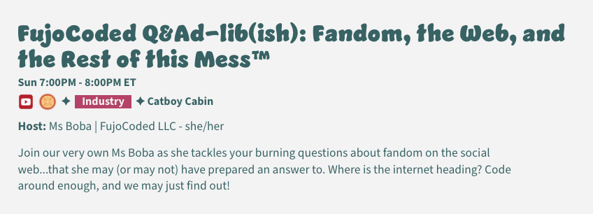

<!-- ⚠️ AUTO-GENERATED — edit _blocks/ instead ⚠️ -->

## 15% off your Timeless Ship 💌 + 🍋 CitrusCon Q&A now Open

> **tl;dr:** send in your Qs [for our CitrusCon
> Q&A](https://citruscon.fillout.com/fujocoded-qna) & get 15% off [the new and
> improved RobinBoob](https://robinboob.com). Read below for deetz 👇

Greetings, _fu(jo|dan|jin)_ and
friends, 
First off: **the _full_ newsletter is coming out this week!** But here's a
itty-bitty taster we want to make sure got to you..._in time_.

### Meet us @ CitrusCon — Send in your Q&A

This Sunday, March 1st 2026, we’ll be (once again) **[haunting the virtual halls
of CitrusCon](https://www.citruscon.com/)—not with a talk, but with a
“Q&Ad-lib”**, an innovative panel format where Ms Boba attempts to prepare in
advance, runs out of time, and is then forced to improvise live. Luckily, she’s
good at that! _…or is she?_

**If you want to help her—or, you know, the opposite—[send in your questions
here](https://citruscon.fillout.com/fujocoded-qna)**. We’ll be focusing on the
future of the fandom web and how we can build it together.

Registration closes Thursday, February 26th 2026, so [be sure to grab your
tickets
now!](https://www.eventbrite.com/e/citrus-con-2026-tickets-1425812867669)

_And with this..._

### Valentine's Day Promo: Time-Crossed Lovers Edition

_Rejoice, Shippers!_ Come hither and **feast your eyes on the [new, improved
RobinBoob](https://robinboob.com), featuring a week-long, 15%-off-all-ships
Valentine's Day bonanza.**

Now, some naysayers might cry: _"but how can you have a Valentine's promo, when
February 14th was more than a week ago?"_ Irrelevant! **What is _time_ to _real
love_?** And what are other powerful, terrifying forces like, you know, _launch
deadlines_?

So whether you're a budding investor claiming [exclusive ownership of your
special rarepair](https://robinboob.com/buy-ship?characters=37017649,1751878)
for the first time, or a seasoned trader saving [yet another timeless
couple](https://robinboob.com/buy-ship?characters=9615118,1459) from fans who
"don't get them like you do", [head forth to
RobinBoob.com](https://robinboob.com) and **use code `LOVE_IS_TIMELESS` to
kickstart your very own VC (_Valentine Certificates_) fund.**

And now, the ~~weather~~ updates:

- **In Top Shipshape:** What better way to spend New Year holidays than to
  revisit one of [our most beloved ~~moneymakers~~ April 1st
  jokes](https://www.essentialrandom.dev/posts/april-1st-tradition-part-2)?
  RobinBoob came out the other side of 2025 with a serious "new year, new me":
  we added PayPal (our longest-standing request), braved database optimization
  so searches aren't painfully slow, and snuck in a handful of quality-of-life
  improvements [ready for you to discover on your
  own](https://robinboob.com/buy-ship?characters=4622,4625). **The short
  version: everything's faster, smoother, more featureful**—and, of course,
  ready to take your hard-earned money in exchange for meaningless JPEGs _(...or
  are they?)_.
- **Certified Gift-Giver:** In true Valentine's spirit, **you can now officially
  gift ship certificates to other people.** No more putting in your bestie's
  email at checkout and hoping Stripe won't forward your credit card details
  (_it wouldn't_): we've built **a proper gifting flow, complete with a
  notification email and personal note**, so your giftees will always know
  you're thinking of them thinking of fictional characters smashing. If you
  haven't sent a proper Valentine's yet, this makes **[the perfect gift for your
  partner](https://robinboob.com/buy-ship?characters=414,409), your best friend,
  or even just yourself.** Already sent one? Well, you know what we think: _time
  means nothing when you're sharing some love._
- **Return of the Ship-Watchers:** Remember when **the RobinBoob Twitter account
  used to post every ship purchase**, uniting us in celebration of each other's
  excellent taste, or _(for some)_, in the pleasure of inflicting our
  questionable palate upon others? Unfortunately, having fallen to ["imperscrutable business acumen"](https://www.wired.com/story/twitter-data-api-prices-out-nearly-everyone/), that tradition was lost..._until now_: starting today,
  **Ship-watching is back on all our store socials**
  ([tumblr](https://www.tumblr.com/fujostore),
  [mastodon](https://blorbo.social/@fujostore), and
  [bluesky](https://bsky.app/profile/fujostore.bsky.social)) _except
  [Twitter](https://x.com/fujostore)_. Subscribe, spectate, and ~~judge~~
  celebrate accordingly—and obviously, [buy some ships to add to the
  feed.](https://robinboob.com/)

_P.S. to honor this relaunch, **we'll be reposting one ship from our archive
every 6 hours** (in chronological order) until we're all caught up. If you see
yours, make sure to boost it with your very own certificate!_
