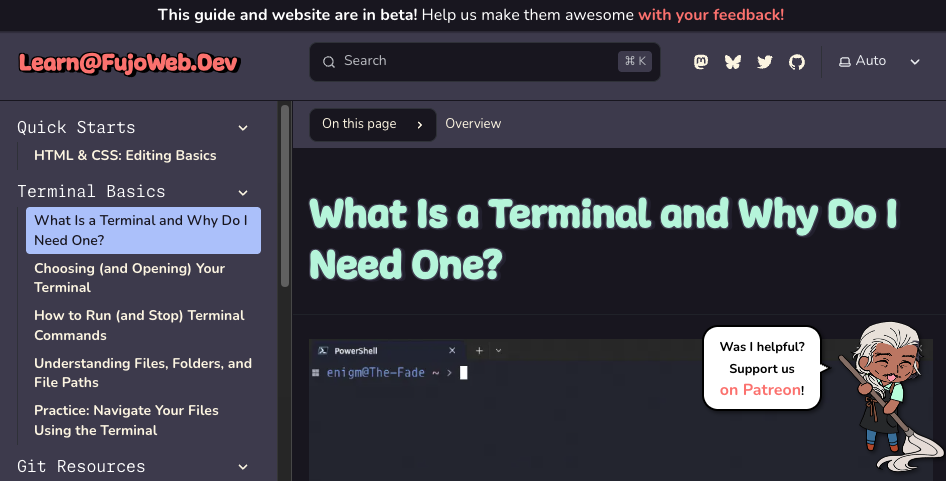
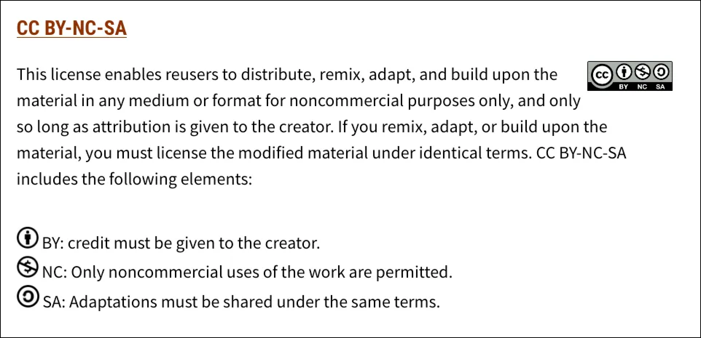
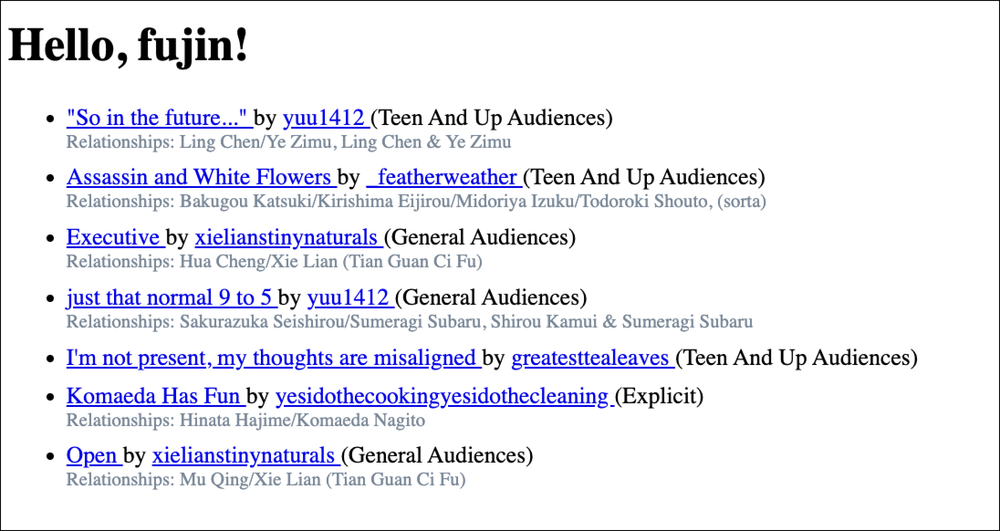
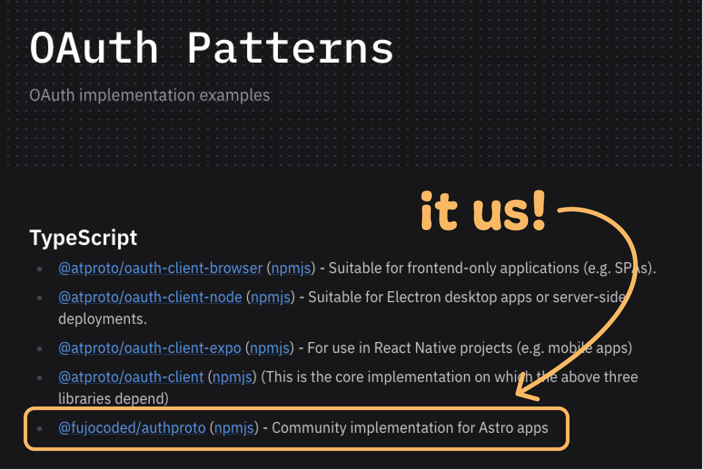

<!-- ⚠️ AUTO-GENERATED — edit _blocks/ instead ⚠️ -->

Greetings, _fu(jo|dan|jin)_ and
friends, 
It's almost _that_ time of the year again, when [BobaBoard
retrospectives](https://bobaboard.com/blog) get written and April 1st jokes are
planned and "one way or the other" delivered. Before we go **heads down again on our Recurring
Spring Obligations™ (and FujoGuide Issue 2, our current priority)**, here's the
roundup of what we've been up to since you last ~~saw~~ read us.

> **🌸✨ A FRIENDLY NOTE ✨🌸**
>
> This edition was written by Ms Boba herself, without much chance for others to
> ~~stop her~~ help review and revise. Please enjoy her typos, writing quirks,
> excessive parentheticals (and occasional digressions (and nested asides)).

## FujoCoded General News

- **Juicy Con-centrate:** On March 1st, we (once again) **[haunted the virtual
  halls of CitrusCon](https://www.citruscon.com/)—not with a talk, but with a
  “Q&Ad-lib”**, an innovative panel format where **Ms Boba attempts to prepare
  in advance, fails, and is then forced to improvise live.** Luckily, she's good
  at that..._or was she?_ Unfortunately, you'll have to wait for the recording to
  find out. In the meantime, you can catch up by rewatching her [2024 talk
  “Rebuilding Community on the
  FujoWeb”](https://www.essentialrandomness.com/posts/rebuilding-community-on-the-web/part-1)
  and [her 2025 talk “Working Together in a Dying
  World”](https://www.youtube.com/watch?v=Pr3A_Xk8wfw).

- **It Takes an Orchard:** And as it is _also_ (an admittedly-less-known) tradition, **we
  ~~haunted~~ hosted a WebDev help [CitrusCon](https://www.citruscon.com/)
  booth/workshop space**—a.k.a. a Discord thread. In there, some of **our
  volunteers, contractors, and general friends provided help with websites,
  JavaScript woes, and general tech inquiries.** Legend says, we may even have
  helped some folks get their hands [on the Issue 1 Preview of FujoGuide](https://www.fujoweb.dev/volume-0#issue-1) 👀
  _Thank you_ to all who showed up to meet and chat with us!

- **Pairin’ Up**: Couldn't make it to CitrusCon? Live your BL-fest dreams
  vicariously by shipwatching—that is, by **gazing into the [endless stream of
  RobinBoob purchases](https://robinboob.com/) flowing into _almost_ all our
  @fujostore socials**
  ([Tumblr](https://www.tumblr.com/fujostore)/[Mastodon](https://blorbo.social/@fujostore)/[Bluesky](https://bsky.app/profile/fujostore.bsky.social)).
  Add your ship to the _extended_ parade **using code `LOVE_IS_TIMELESS` for 15%
  off**, then channel
  the spirit of [a tried-and-true BL
  umarell](https://en.wikipedia.org/wiki/Umarell) and ~~judge~~ celebrate
  everyone's taste. But hurry: **only one single _certified (owner)shipper_ can
  get their hands on each OTP.** Who will claim _yours_?

- **`Get-ProjectManager`'d:** Thanks to last newsletter's plea, **we have an
  official Project Manager!** While not _exactly_ a fujin (yet?), **[James](/contributors/james) is a
  wise, older, non-binary eldritch horror of knowledge** who has been helping
  fan communities since 1995...and now helps _us_. Other than **guiding the
  transition from Ms Boba's planet-sized charts to _actual GitHub issues_**, and
  wrangling our ~~raccoons~~ collaborators in her stead, James has introduced us
  to [Posh-chan, Microsoft's official PowerShell gijinka](https://x.com/PowerShell_Team/status/857319999383363585) and absolute BombShell
  of a... shell. Now _that_ is culture fit!

- **$upporters in the Loop:** Our $upporters Area continues to hit
  milestones...and now **hits our Discord server with a daily reminder of
  _exactly_ how generous our $upporters are.** Aside from lending us
  strength when code (or prose) _just won't behave_, it lets us know
  our database is synced, and **our _not-finished-but-ravingly-(pre)reviewed_ $upporters lounge can now welcome our latest patrons**. Unfortunately,
  it's hard to test this code without new $upporters...so if you wish to help us "test in production"—_no other reason, really_—**[pledge to our Patreon](https://www.patreon.com/c/fujocoded) and become our angel ~~investor~~ tester.**

## FujoCoded BackerKit Update

### FujoCoded BackerKit Fulfillment Progress: Recent

- **Coding in Space(s):** There's a new article at the event horizon!
  [Sel](/contributors/sel) and [Grubdog](/contributors/grubdog) joined forces to
  [(space)ship learn@ readers](https://learn.fujoweb.dev/) straight into a full
  development environment by teaching them about GitHub Codespaces. **Want to
  Halo jump into coding your site or contributing to one of our projects**
  without first installing a bunch of stuff? ~~Steal compute from~~ Leverage
  Microsoft's generous (free) offerings and [get a full computer in your
  browser](https://github.com/features/codespaces)—Catboys, alas, not included.

- **One (S)hell of a Breakup:** Last you heard from us, we were splitting up
  [NPM](https://learn.fujoweb.dev/npm/what-is-npm/)
  [articles](https://learn.fujoweb.dev/npm/npm-in-practice/) to (allegedly)
  improve their readability. Having acquired a taste for dramatic breakups—in,
  you know, _true fujo spirit_—we've proceeded to tear more articles apart:
  **["What is a
  Terminal?"](https://learn.fujoweb.dev/terminal/what-is-a-terminal/) and
  ["Choosing your
  Terminal"](https://learn.fujoweb.dev/terminal/choosing-a-terminal/) have,
  _alas(?)_, separated, and we've also thrown the _absolutely-not-quick_ Terminal series
  out of "quickstarts".** ["HTML & CSS: Editing
  Basics"](https://learn.fujoweb.dev/quickstarts/editing-html-css/), now alone,
  claims it's nice to have the section all for themselves, but we know _denial_
  and _mutual pining_ when we see it.

- **Spec-tacularly Written:** Speaking of _moving out on your own_, **our
  community is stepping up to help us create the
  [learn@](https://learn.fujoweb.dev/) we all wish to see on the web**. But this
  very appreciated collaboration, while "just as ~~planned~~ hoped", adds the
  extra challenge of \*deep breath\* _creating a cohesive creative vision across
  a variety of creatives_. To (style) guide us,
  **[Rie](/contributors/notavodkashot) has updated—and even PR'd!—[our
  community@'s learn@ writing
  specs](https://community.fujocoded.com/fujowebdev/style-guide/style/).**
  Incidentally, we've also discovered [the Diataxis
  framework](https://diataxis.fr/), which has helped us all get on the same
  (web)page not just about the _how_ but the _what_ we're writing. Wish us
  ~~luck~~ sweat, but eventual success!

- **License to Learn:** Nothing like having to make legal decisions reminds you
  the ol' 9 to 5 still has its perks. Thankfully, rather than giving into
  despair and dusting off our resumes, **we put on our bravest attitude, faced
  our fears, and worked out a dual-licensing model for learn@ articles.** In a
  few words: [Creative Commons
  Attribution-NonCommercial](https://creativecommons.org/licenses/by-nc-sa/4.0/deed.en)
  for the public (_so **everyone can copy and remix our articles**—but not sell
  them_), and a more permissive license for FujoCoded (_so **we can write our paid
  Zines and coding offerings** without legal anxieties_). You'll hear more about
  this in future newsletters: the legal ducks are, after all, ever waddling 🦆🦆🦆

### FujoCoded BackerKit Fulfillment Progress: Future

- **Nearly Viable Manuscript:** Now that we're in the future (section), you may
  wonder where [our article on installing
  `NVM`](/updates/25-12-23-tis-the-season#nvm-extras) is at. TL;DR(eview):
  Submerged in an avalanche of `"//TODO"`s, **we left the most complete article
  for last...then found it needed just _a bit more_ style-guide polish to fit
  with its peers**. While we didn't have time to give it, there's no need to
  despair: we're currently pushing and pulling pronouns, tenses, bulletpoints,
  and assorted Starlight components, and **will publish this excellent article as
  soon as we've bestowed it the appropriate _\~learn@ vibe\~_.**

- **Taken for (April) Fools:** We have so many great things cooking, and they
  all deserve their time _and space_ to simmer! Between polishing articles, our ongoing
  FujoGuide rewrite, and FujoCoded's LLC _#1 Company Holiday_ slash _Prime
  Immovable Deadline™_—that is, our April 1st fun(d)raiser—**we'll keep Learn@
  work going in the background so it can properly absorb all those creative juices.**

## Intermission — A Word _to_ our $ponsors

**This update (and ongoing work) is brought to you [by our lovely
Patrons](https://www.patreon.com/c/fujocoded):** our raccoon-employees demand
the _fanciest of trash_, and those legal ducks will only waddle on _premium
grain_—we couldn't feed them without you all!

If you've not boarded our _ship_ yet, [jump on our Patreon
now](https://www.patreon.com/c/fujocoded)! Tiers start at $3/month, and give you
access to coupons and discounted or limited-edition merchandise. **We're working
on a $upporters area so you can (among others) showcase your blorbo [on a big
wall](https://bobaboard.com/blorbos-wall-2022)!**

**_Did you know?_** Studies show [our
Patrons](https://www.patreon.com/c/fujocoded) are 47% more likely to have their
OTP become canon...or have them explode in a juicy cloud of drama—whatever their
preference.

## Around the FujoVerse

### In the Git(hub)

- **Welcome to the GitHub:** A warm shoutout to the **newest first-time
  contributors to our GitHub—and _for some_ GitHub itself: [TODO: NAMES]!**
  Whether with a PR, a review, or a README, their generous contribution keeps us
  going and _(not going to lie)_ makes us shed little tears of gratitude. **Thank you
  for making the FujoVerse a little bit shinier ✨**

- **Astro-nomical Fanfic Data:** Scraping AO3 data is fun, but you know what's
  _even more fun_ (and simple)? **Using AO3 data in your Astro webiste with our
  [Astro AO3 loader
  plugin](https://github.com/FujoWebDev/fujocoded-plugins/tree/main/astro-ao3-loader)!**
  This plugin's first official release now works with Astro 5, and **supports
  _series_ in addition to _works_.** Plus, **[Ev](/contributors/ev) (our _valiant
  hero_) gave it [a proper
  README](https://github.com/FujoWebDev/fujocoded-plugins/tree/main/astro-ao3-loader#fujocodedastro-ao3-loader)!**
  So go forth now, load fics on your Astro site, and call it "_learning webdev_"...cause
  it totally is!

- **AO3.js goes Adult:** Our [AO3 scraping
  library](https://github.com/FujoWebDev/AO3.js)/Official "Fan Bait" Project™
  got a bunch of upgrades: we've **added support for adult works** (we see you
  😎) **and listing tag synonyms** (for internal purposes _Certified Shady®_ 🥷),
  exported Zod schemas for ease of integration (e.g. our Astro loader
  plugin 👀👆), and overhauled error handling. **Check out the [release
  notes](https://github.com/FujoWebDev/AO3.js/releases/tag/v0.23.0) for the full changelog.**

- **Official Rec-list:** Last but not least: `@fujocoded/authproto`, our [ATProto
  authentication library for Astro
  sites](https://github.com/FujoWebDev/fujocoded-plugins/tree/main/astro-authproto),
  is now **recommended in [the official ATProto documentation](https://atproto.com/guides/oauth-patterns)**. Look,
  fandom! _Senpai noticed us._ No pressure.

## FujoStore Highlights: Restocks, Sales, and Limited-Time Offers

You've (hopefully) already seen **[our RobinBoob
relaunch](/updates/26-02-23-my-endless-valentine) and associated "limited-time
offer"**, which officially expired..._almost a week ago_.

That said, and _stop me if you've heard this..._**what is time, to real love?**

To celebrate finally making it past the writing _a lot of copy_ (an avoid
setting up _another promo_) we're extending **RobinBoob's Valentine's Day 15% off
(with code `LOVE_IS_TIMELESS`) until March 14th!** Come forth! Come all! [Buy on
RobinBoob.com!](https://robinboob.com)

## Collaborate with Us\!

Want to help us help the fandom web? Are you a social campaign expert wishing
for some monetary return (💰), or a GitHub connoisseur willing to donate your
time to The Cause™? Read on!

- **\[🙏\]One Peer to Herd Them All:** We're not quite ready yet (the draft
  needs a few more weeks), but **we'll soon be looking for a volunteer beta
  readers coordinator to help wrangle FujoGuide Issue 2 Beta 2.** The gig: sit
  in a Discord group DM with 6-7 fannish beginners as they brave our GitHub
  zine, and help them surface unscathed. **You don't need deep GitHub
  expertise** —just enough familiarity to get beginners unstuck. **If this
  sounds like your thing, reach out NOW** so we can hit the ground running when
  it's time. [DM us](https://fujocoded.com/find-us) or write us at
  [contacts@fujocoded.com](mailto:contacts@fujocoded.com)!

- **\[💰\]Social Media Campaign Lead & Copywriter:** Are you a fandom person (or
  adjacent) with a penchant for _capturing the hearts (and eyes) of your fellow
  netizens?_ **We're looking for a <u>paid contractor</u> to plan/write social
  media launch campaigns for our projects and products**—think Bluesky threads,
  cross-platform posts, and short newsletter blurbs. **You'll own the campaign
  timelines, wrangle the content delivery,** and work directly with our founder to help us
  sound like ourselves...just uncharacteristically _on schedule_. **This is a
  per-campaign role ($150–250/campaign), and we welcome experience from
  non-traditional avenues:** fandom, zine promo, indie launches, crowdfunding,
  or anywhere you've had to get people excited and rallying. **[Apply
  here!](https://forms.gle/8An4oeVTCMoHQixf9)**

## That’s All, Folks\!

And with this, it's all for these months! It took us _a long while_, but we've made it
on the other side..._somehow._

FujoGuide updates aside (follow them [on our socials]()), **we'll see you on the other side
of March 31st 👀** until then, "good night, ship tight, don't let the discourse bite!"

_Yours,_ 
_The FujoCoded LLC Team_
