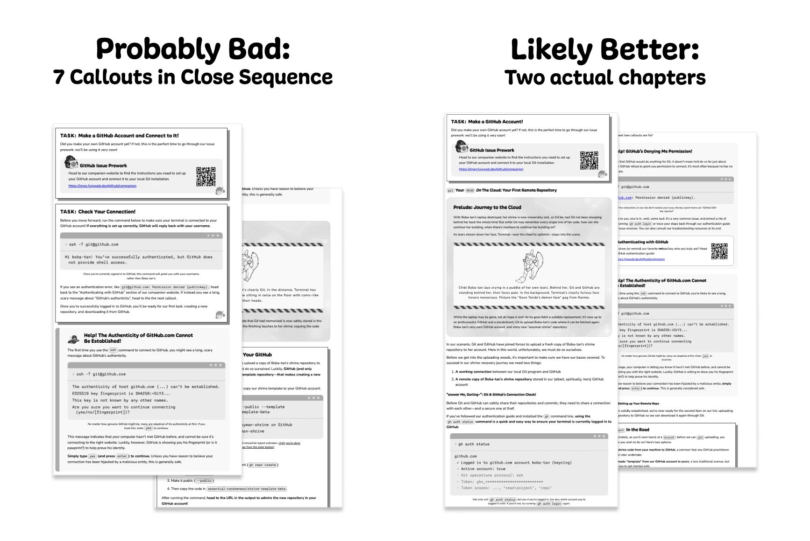

<!-- ⚠️ AUTO-GENERATED — edit _blocks/ instead ⚠️ -->

Greetings, _fu(jo|dan|jin)_ and
friends, 
It's almost _that_ time of the year again, when [BobaBoard
retrospectives](https://bobaboard.com/blog) get written and April 1st jokes are
planned and _(one way or the other)_ delivered. Before we go **heads down again on our Recurring
Spring Obligations™ and FujoGuide Issue 2, our current priority**, here's the
roundup of what we've been up to since you last ~~saw~~ read us.

> **🌸✨ A FRIENDLY NOTE ✨🌸**
>
> This edition was written by Ms Boba herself, without much chance for others to
> ~~stop her~~ help review and revise. Please enjoy her typos, writing quirks,
> excessive parentheticals (and occasional digressions (and nested asides)).

## FujoCoded General News

- **Juicy Con-centrate:** On March 1st, we (once again) **[haunted the virtual
  halls of CitrusCon](https://www.citruscon.com/)—not with a talk, but with a
  “Q&Ad-lib”**, an innovative panel format where **Ms Boba attempts to prepare
  in advance, fails, and is then forced to improvise live.** Luckily, she's good
  at that..._or was she?_ Unfortunately, you'll have to wait for the recording to
  find out. In the meantime, you can catch up by rewatching her [2024 talk
  “Rebuilding Community on the
  FujoWeb”](https://www.essentialrandomness.com/posts/rebuilding-community-on-the-web/part-1)
  and [her 2025 talk “Working Together in a Dying
  World”](https://www.youtube.com/watch?v=Pr3A_Xk8wfw).

- **It Takes an Orchard:** And as it is _also_ (an admittedly-less-known) tradition, **we
  ~~haunted~~ hosted a WebDev help [CitrusCon](https://www.citruscon.com/)
  booth/workshop space**—a.k.a. a Discord thread. In there, some of **our
  volunteers, contractors, and general friends provided help with websites,
  JavaScript woes, and general tech inquiries.** Legend says, we may even have
  helped some folks get their hands [on the Issue 1 Preview of FujoGuide](https://www.fujoweb.dev/volume-0#issue-1) 👀
  _Thank you_ to all who showed up to meet and chat with us!

- **Pairin’ Up**: Couldn't make it to CitrusCon? Live your BL-fest dreams
  vicariously by shipwatching—that is, by **gazing into the [endless stream of
  RobinBoob purchases](https://robinboob.com/) flowing into _almost_ all our
  @fujostore socials**
  ([Tumblr](https://www.tumblr.com/fujostore)/[Mastodon](https://blorbo.social/@fujostore)/[Bluesky](https://bsky.app/profile/fujostore.bsky.social)).
  Add your ship to the _extended_ parade **using code `LOVE_IS_TIMELESS` for 15%
  off**, then channel
  the spirit of [a tried-and-true BL
  umarell](https://en.wikipedia.org/wiki/Umarell) and ~~judge~~ celebrate
  everyone's taste. But hurry: **only one single _certified (owner)shipper_ can
  get their hands on each OTP.** Who will claim _yours_?

- **`Get-ProjectManager`'d:** Thanks to last newsletter's plea, **we have an
  official Project Manager!** While not _exactly_ a fujin (yet?), **[James](https://fujocoded.com/contributors/james) is a
  wise, older, non-binary eldritch horror of knowledge** who has been helping
  fan communities since 1995...and now helps _us_. Other than **guiding the
  transition from Ms Boba's planet-sized charts to _actual GitHub issues_**, and
  wrangling our ~~raccoons~~ collaborators in her stead, James has introduced us
  to [Posh-chan, Microsoft's official PowerShell gijinka](https://x.com/PowerShell_Team/status/857319999383363585) and absolute BombShell
  of a... shell. Now _that_ is culture fit!

- **$upporters in the Loop:** Our $upporters Area continues to hit
  milestones...and now **hits our Discord server with a daily reminder of
  _exactly_ how generous our $upporters are.** Aside from lending us
  strength when code (or prose) _just won't behave_, it lets us know
  our database is synced, and **our _not-finished-but-ravingly-(pre)reviewed_ $upporters lounge can now welcome our latest patrons**. Unfortunately,
  it's hard to test this code without new $upporters...so if you wish to help us "test in production"—_no other reason, really_—**[pledge to our Patreon](https://www.patreon.com/c/fujocoded) and become our angel ~~investor~~ tester.**

## The Fujoshi Guide to Web Development

Last newsletter, we talked about focusing on FujoGuide Issue 2 with the new
year—and we did! But the more we wrote, the more something felt off. Not
everyone agreed: **our beta readers loved the issue**, the feedback said in
unison, **and their points of confusion were just "_GitHub_ being _GitHub_"**.
Could we have left it at that? Sure! But **have we ever took _"it's supposed to be
confusing"_ as an answer?"**

Read on for our diagnosis (and solution) ✨

### Recent Progress on FujoGuide

- **The Issue with Our Issue:** A key part of making what's technical approachable
  is **finding the right balance between over- and under-explaining,** and our
  chapters had tipped hard into "everything, everywhere, all at once". The
  "Cloning & Remotes" chapter alone, for example, juggled a) SSH setup, b) HTTP
  vs SSH addresses, c) creating remote repositories, _and_ d) an overview of
  distributed repositories connecting to the same remote. Crammed into "asides"
  boxes without room to breathe, **everything felt both rushed _and_ slow**—too
  much content before you got to "Git your hands dirty", but no space for any
  idea to land. **_The diagnosis?_ Right content, wrong structure.**

  

- **Issue'ing Our Extra Chapters:** Armed with this new understanding, we've
  been reorganizing chapters, reshuffling sections, and generally performing the
  technical writing equivalent of gutting canon down to its studs to rebuild it
  around your OTP's perfect ending. And **when you start splitting overstuffed
  chapters apart, some of that content finds a better home on its own**...in
  this case, this issues' newly unveiled extra chapters:

  1. **"Keeping Your Branch Up to Date"** — a.k.a. the bane of everyone's
     _git-xistence_, a.k.a. what to do when you have a feature in progress but
     your `main` won't _stop (updating) for no one_...not even yourself
  2. **"Uploading Local Code to GitHub"** — We made the bold choice to start our
     guides from Git, and our GitHub guide from "code already on GitHub". We stand
     by both: `git clone`ing an existing repo is straightfoward, but uploading local
     code to a new repo goes so much smoother on the _other side_ of a few `git push`es.
  3. **"Multiple Remotes"** — Did you know **you can push and pull code between
     different repositories without going through GitHub?** This (optional) chapter
     shows people why GitHub is structured like "a hub"—an invaluable mental
     model to help move from your own repository to collaborating with others!

- **Poasting through (G)it:** ...and we're doing all this _in public_ (as time
  permits)! For those yearning for a front-row seat, **Ms Boba's been
  liveblogging the writing process:** chapter restructuring, table-of-contents
  poking and prodding, head-banging walls while thinking about section
  ordering..._the works._ Follow along on her socials (or FujoGuide's) for a
  look at how the sausage ~~is made~~ is taken apart and reassembled. Next one
  due soon!

- **Git Intro'd:** We've also **taken another next step into expanding the Git
  chapters on our site.** In our new intro chapter, written [by our friend
  Hyena](https://fujocoded.com/contributors/hyena) and [appropriately named "Say Hi to Git (and
  GitHub)"](https://learn.fujoweb.dev/git/intro/), we **give a real quick overview
  of Version Control to help teach it (and sell it) to all visitors to our site**—not just our zine buyers!

### What's Next for FujoGuide

- **Staying A-live(blogging):** This newsletter, a CitrusCon talk, and a certain
  Valentine's Day launch may have _slightly_ delayed our next liveblog, but
  social followers **will get another zine progress update on either side of the
  end of the week.** We contain multitudes (in both talents and deadlines), and
  _[✨new & overdue achievement✨]_ we've learned better than to promise specific
  progress...but **we're past _"the really messy part"_**, heading into a
  tiny, half-way through _flow-switcharoo_.

- **Dawn of the Extra Chapters:** Once the main ones are locked in, **it's new
  chapters time!** The foundation (cut from the old chapters) is already
  there, **so this will be less "writing new content from scratch" and more
  "expanding each extra to cover _all_ that matters".** If you wish to keep up
  with progress...you know where to go!

- **One Peer to Herd Them All :** And _then_...Beta 2! Once we're sure on a
  timeframe for wrapping up this rewrite, we'll be looking for a coordinator to
  wrangle our chosen betas through one (final 🤞) round. **Willing to sit in a
  Discord group DM with 7-8 fannish GitHub beginners _(sometime in the next 2
  months)_ and make sure they don't get _too_ stuck?** Write us at
  [contacts@fujocoded.com](mailto:contacts@fujocoded.com). We'll be in touch!

## Intermission — A Word _to_ our $ponsors

**This update (and ongoing work) is brought to you [by our lovely
Patrons](https://www.patreon.com/c/fujocoded):** our raccoon-employees demand
the _fanciest of trash_, and those legal ducks will only waddle on _premium
grain_—we couldn't feed them without you all!

If you've not boarded our _ship_ yet, [jump on our Patreon
now](https://www.patreon.com/c/fujocoded)! Tiers start at $3/month, and give you
access to coupons and discounted or limited-edition merchandise. **We're working
on a $upporters area so you can (among others) showcase your blorbo [on a big
wall](https://bobaboard.com/blorbos-wall-2022)!**

**_Did you know?_** Studies show [our
Patrons](https://www.patreon.com/c/fujocoded) are 47% more likely to have their
OTP become canon...or have them explode in a juicy cloud of drama—whatever their
preference.

## Around the FujoVerse

### In the Git(hub)

- **Welcome to the GitHub:** A warm shoutout to the **newest first-time
  contributors to our GitHub—and _for some_ GitHub itself:
  <<<<<<<
  [Ev](https://fujocoded.com/contributors/ev), [Hyena](https://fujocoded.com/contributors/hyena) _(✨first ever!✨)_, PC
  _(✨first ever!✨)_, and [Rie](https://fujocoded.com/contributors/rie) _(✨first ever!✨)_!** Whether
  =======
  [Ev](/contributors/ev), [Hyena](/contributors/hyena) _(✨first ever!✨)_, deepspaceaxolotl
  _(✨first ever!✨)_, and [Rie](/contributors/rie) _(✨first ever!✨)_!\*\* Whether

  > > > > > > > with a PR, a review, or a README, their generous contribution keeps us going
  > > > > > > > and _(not going to lie)_ makes us shed little tears of gratitude. **Thank you
  > > > > > > > for making the FujoVerse a little bit shinier ✨**

- **Astro-nomical Fanfic Data:** Scraping AO3 data is fun, but you know what's
  _even more fun_ (and simple)? **Using AO3 data in your Astro webiste with our
  [Astro AO3 loader
  plugin](https://github.com/FujoWebDev/fujocoded-plugins/tree/main/astro-ao3-loader)!**
  This plugin's first official release now works with Astro 5, and **supports
  _series_ in addition to _works_.** Plus, **[Ev](https://fujocoded.com/contributors/ev) (our
  _valiant hero_) gave it [a proper
  README](https://github.com/FujoWebDev/fujocoded-plugins/tree/main/astro-ao3-loader#fujocodedastro-ao3-loader)!**
  So go forth now, load fics on your Astro site, and call it "_learning
  webdev_"...cause it totally is!

- **AO3.js goes Adult:** Our [AO3 scraping
  library](https://github.com/FujoWebDev/AO3.js)/Official "Fan Bait" Project™
  got a bunch of upgrades: we've **added support for adult works** (we see you
  😎) **and listing tag synonyms** (for internal purposes _Certified Shady®_
  🥷), exported Zod schemas for ease of integration (e.g. our Astro loader
  plugin 👀👆), and overhauled error handling. **Check out the [release
  notes](https://github.com/FujoWebDev/AO3.js/releases/tag/v0.23.0) for the full
  changelog.**

- **Official Rec-list:** Last but not least: `@fujocoded/authproto`, our
  [ATProto authentication library for Astro
  sites](https://github.com/FujoWebDev/fujocoded-plugins/tree/main/astro-authproto),
  is now **recommended in [the official ATProto
  documentation](https://atproto.com/guides/oauth-patterns)**. Look, fandom!
  _Senpai noticed us._ No pressure.

## FujoStore Highlights: Restocks, Sales, and Limited-Time Offers

You've (hopefully) already seen **[our RobinBoob
relaunch](https://fujocoded.com/updates/26-02-23-my-endless-valentine) and associated "limited-time
offer"**, which officially expired..._almost a week ago_.

That said, and _stop me if you've heard this..._**what is time, to real love?**

To celebrate finally making it past the writing _a lot of copy_ (an avoid
setting up _another promo_) we're extending **RobinBoob's Valentine's Day 15% off
(with code `LOVE_IS_TIMELESS`) until March 14th!** Come forth! Come all! [Buy on
RobinBoob.com!](https://robinboob.com)

## Collaborate with Us\!

Want to help us help the fandom web? Are you a social campaign expert wishing
for some monetary return (💰), or a GitHub connoisseur willing to donate your
time to The Cause™? Read on!

- **\[🙏\]One Peer to Herd Them All:** We're not quite ready yet (the draft
  needs a few more weeks), but **we'll soon be looking for a volunteer beta
  readers coordinator to help wrangle FujoGuide Issue 2 Beta 2.** The gig: sit
  in a Discord group DM with 6-7 fannish beginners as they brave our GitHub
  zine, and help them surface unscathed. **You don't need deep GitHub
  expertise** —just enough familiarity to get beginners unstuck. **If this
  sounds like your thing, reach out NOW** so we can hit the ground running when
  it's time. [DM us](https://fujocoded.com/find-us) or write us at
  [contacts@fujocoded.com](mailto:contacts@fujocoded.com)!

- **\[💰\]Social Media Campaign Lead & Copywriter:** Are you a fandom person (or
  adjacent) with a penchant for _capturing the hearts (and eyes) of your fellow
  netizens?_ **We're looking for a <u>paid contractor</u> to plan/write social
  media launch campaigns for our projects and products**—think Bluesky threads,
  cross-platform posts, and short newsletter blurbs. **You'll own the campaign
  timelines, wrangle the content delivery,** and work directly with our founder to help us
  sound like ourselves...just uncharacteristically _on schedule_. **This is a
  per-campaign role ($150–250/campaign), and we welcome experience from
  non-traditional avenues:** fandom, zine promo, indie launches, crowdfunding,
  or anywhere you've had to get people excited and rallying. **[Apply
  here!](https://forms.gle/8An4oeVTCMoHQixf9)**

## That’s All, Folks\!

And with this, it's all for these months! It took us _a long while_, but we've made it
on the other side..._somehow._

FujoGuide updates aside (follow them [on our socials](https://fujocoded.com/find-us#fujowebdev)), **we'll see you on the other side
of March 31st 👀** until then, "good night, ship tight, don't let the discourse bite!"

_Yours,_ 
_The FujoCoded LLC Team_
