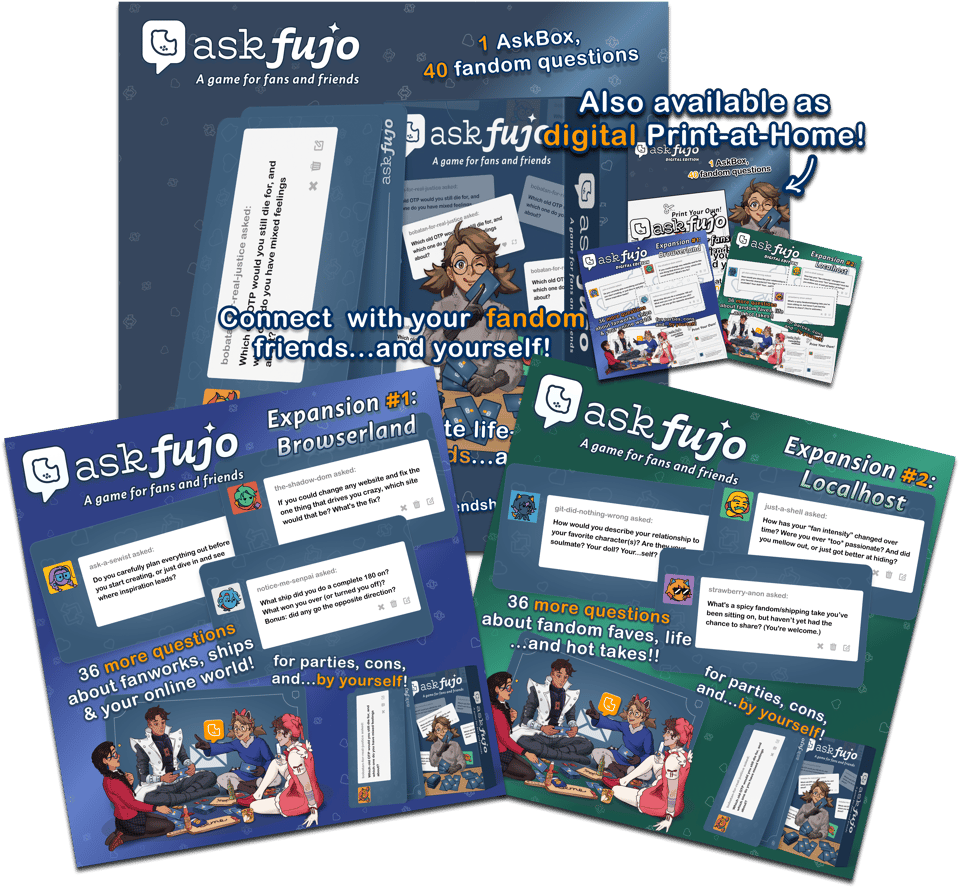
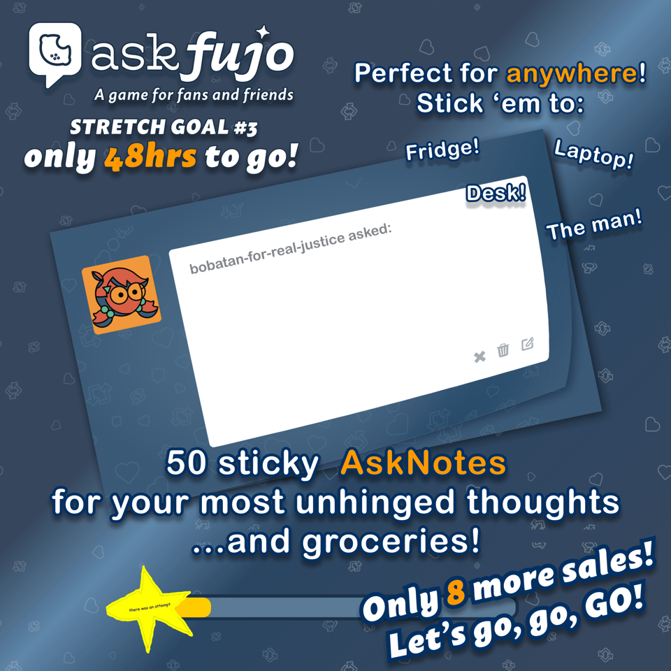

[#FriendlyReminder: there’s ONLY 48 HOURS LEFT](https://store.fujocoded.com/askfujo)! Get your box now 👇 or read on for details!

[Box! Box! Box! Box!](https://store.fujocoded.com/askfujo)

## Wait—what was AskFujo again?

We’re so glad you asked! You know that feeling when a question you’re just dying to answer lights up your Tumblr inbox? Well, we put that in a box—a real, physical (or digital) box.

Grab it before Tumblr sues us! (worth it)

The base game includes 40 cards with general fandom-related questions. But while that’s more than enough to have a blast with friends (or yourself), there’s no such thing as too many asks. That’s why the TWO AskFujo Expansions include 36×2 more cards split across a variety of specialized categories—a grand total of 112 individual cards all about (over)sharing your thoughts (and hot takes) on fandom, fanworks, ships, blorbos, and more!

[I crave that those AskBoxes 📦📦📦🐐](https://store.fujocoded.com/askfujo)

## But wait, there’s more!

With so much content already out, you’d be forgiven for thinking we’ve shown all our cards 👈😎👈. But like a ship that just keeps on giving, we too are all about that slow, burning release.

Meet our next stretch goal: AskNotes.

Slow, burning, sticky release 😏

[Must. Stick. Now.](https://store.fujocoded.com/askfujo#asknotes)

## …It’s not over yet!

While preorders for AskFujo (and, stretch goal permitting 👀🙏, its sticky counterpart) close in **JUST 48 HOURS**, don’t forget to stay tuned in to our [socials](https://blorbo.social/@fujocoded) 💌👇.

Who knows? We might just have a few more tricks up our sleeve... 🪄🃏

See you there,

— The FujoCoded LLC Team
