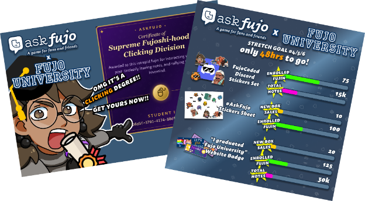
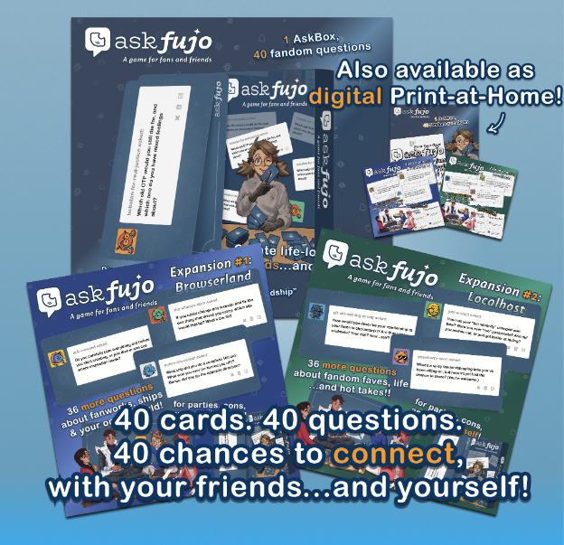
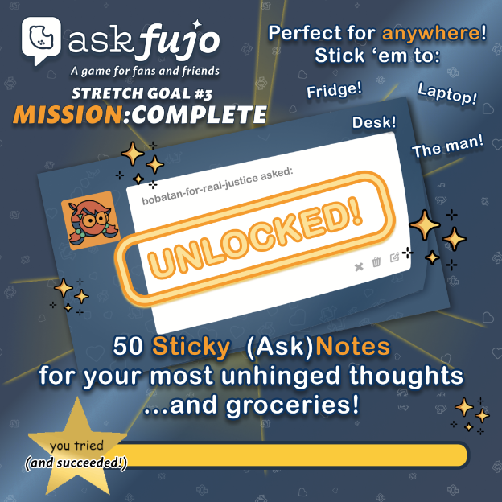
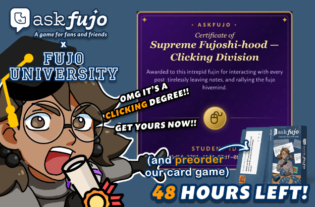
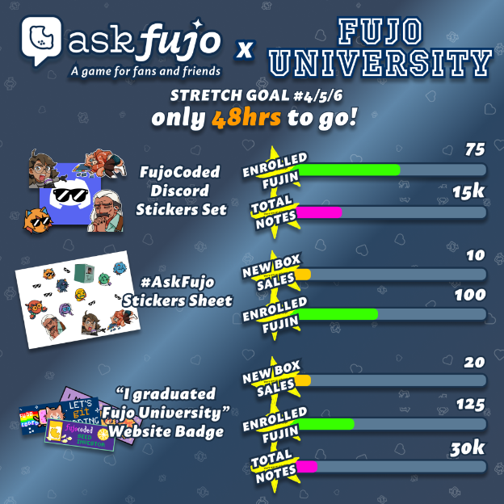
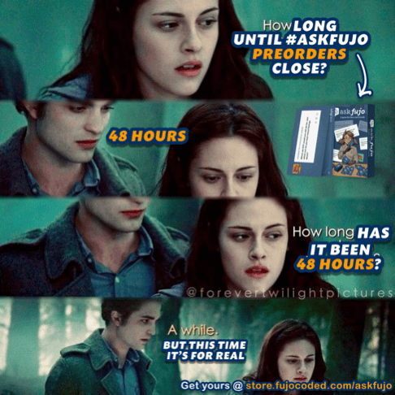

Hey there, **Fellow Fujin™:** 

Did you know there’s only **48 hours left** to preorder [FujoCoded's latest April's Fools project, **AskFujo**](https://store.fujocoded.com/askfujo)?! That's like, **TWO DAYS**. Which means you still have time to check out all the cool stretch goals we've unlocked so far, help us unlock new ones, and earn your **clicking degree from Fujo University** (and website badge? 👀)!

## [Preorder Yours (& get Clicking) here](https://store.fujocoded.com/askfujo)

…or keep on ~~keeping~~ reading on to learn more about AskFujo!

## And AskFujo is…?

You know that feeling when a question that *you’re just dying to answer* lights
up your Tumblr inbox? Well, we put that in a box—a real, physical (*or digital*) box.

[**AskFujo**](https://store.fujocoded.com/askfujo) is a super cool card-based party game to play around and get to know your friends! And their Blorbos! And their hear-me-outs about Fandom!

The base game comes with (at least, *wink-wink*) **40 unique cards with fandom questions** to ask your friends! And like all good games ~~in this economy~~, it comes with [**EXPANSION PACKS**](https://store.fujocoded.com/askfujo#stretch-goals). Which have already been unlocked because this is the coolest community. Now available:

- **Browserland Expansion:** 36 brand new questions about fanworks, ships & the web!
- **Localhost Expansion:** 36 brand new questions about Blorbos, IRL and your hottest, spiciest takes!

That's right, for you, we even brought Anon Hate back.

## **Gimme all the deets!**

You can get **AskFujo** (and **expansions**!) in two distinct flavors:

- **The Physical:** An actual literal box containing actual literal cards (they feel super nice in the hand, admittedly), as well as any other fun knickknacks you pick up on the store! (Who KNOWS what might be unlocked by the time you get there?).
- **The Digital:** For the DIYer you keep in your heart! Or those of you who don’t want to deal with shipping costs and tracking stuff. You will get “print it yourself” files of all your chosen products.

## And there’s more to come!

Do you know what else is out? [AskNotes](https://store.fujocoded.com/askfujo#asknotes)! Our newest, slow-burn, sticky add-on: [a sticky note pad in the format of a ~~Tumblr Ask~~ AskFujo Card](https://store.fujocoded.com/askfujo#asknotes), so you can take your grocery list to new heights. Or ratings.

## But it’s not over yet!

Make sure to [check out our frankly “super hip and with it” **webbed site**](https://store.fujocoded.com/askfujo) that might or might not take you down memory road. If you let it. (And click on things. CLICK ON ALL THE THINGS.)

Who knows what *else* might have unlocked by the time you get there?  

Speaking of which…

## Friends! Fujin! $upporters!

We’ve seen you clicking! And clicking! *And clicking!* We’re happy you’re having fun, and so, we’ve got great news!

Starting now til the store closes, every click you make counts towards the super special new reward! We've partnered with the totally real and 100% legit **Fujo University**, so that all your clicking counts towards your course transcript and you can get your very own **Certificate of Supreme Fujoshihood — Clicking Division**!

Powered by the same unhinged minds that [gave you **RobinBoob**](https://robinboob.com/), you can now earn your very own **Certificate of Supreme Fujoshihood — Clicking Division** by journeying to [**the AskFujo Store**](https://store.fujocoded.com/askfujo) and conquering the trials three:

* Click reblog/like and cause the note counters to go up **10 times**.
* Click like OR reblog OR both in **9 posts**.
* Have **3 friends** click on your referral link and complete at least **1** goal of their own!

Once you succeed, you will unlock your very own **Certificate of Supreme Fujoshihood — Clicking Division**, bringing you one step closer to Supreme Fujoshihood! (Which is both a measurable and attainable thing to want, yes.)

Even better? This gets us all closer to our stretch goals, including an exclusive website badge for all graduates, game-buying or not!!

What are you waiting for?

## [Enroll Now](https://store.fujocoded.com/askfujo)

Don't forget to follow us on your favorite social media, and get live, moment to moment updates on our stretch goals!

See you there,  
*— The FujoCoded LLC Team*

*(...yes, we said 48hrs a couple times, but that was before realizing we could pull a “Tumblr University” joke and that just felt… wrong not to do. So hey, you get more time to browse and shop, and we get to shitpost more fun into existence! Everyone wins.)*

