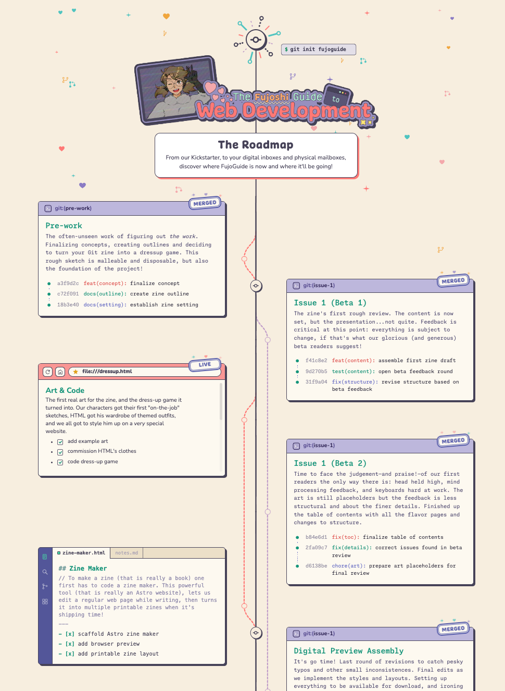
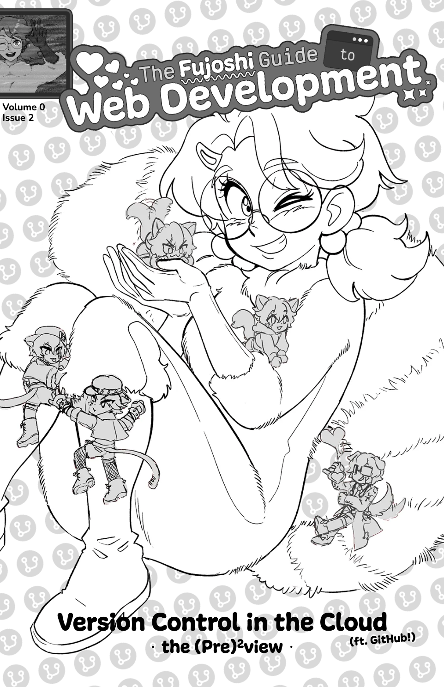
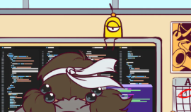
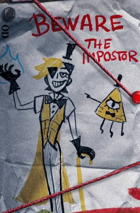

Greetings, fujoshi, fudanshi, fujin, and assorted friends, 
We’re here today with an update on the Zine and a general status report on
Present & Future Progress™\!

But first…a *mea—I mean, nostra (but actually mea) culpa*: we announced we’d send
more frequent updates to keep you all up to date with our progress…and then we,
well, *didn’t*. Our cunning, 100% bulletproof plan was to make a few small
posts—just some tiny notes\!—here and there so we could keep you all in the loop
and as excited as we are about the upcoming zine.

After all…how hard could *that* be?

Turns out, we *accidentally* created additional communication work for
ourselves: the kind *I am—I mean, we are (but actually I am)* the worst at
handling. This, of course, slowed our updates down, because those “small posts”
and “tiny updates” ended up taking a lot more time, effort, and [*joie de
posting*](https://en.wikipedia.org/wiki/Joie_de_vivre) than we’d
anticipated—which, especially after our *socially strenuous* April 1st rally,
compounded into increasingly slower communication cycles.

So now, to ward off these cycles *once and forever* (and because Ms Boba just
*Can’t™*), behold\! Our new plan:

***[FujoCoded is now hiring (Ongoing) Social Media Writers\!](#now-hiring-ongoing-social-media-writers)***

…and also (further below):

* 🗺️ [Releasing the Official, Cool-as-Fuck™ FujoGuide Roadmap](#fujoguides-very-own-and-very-cute-roadmap)

* 📚 …[*soon* releasing *FujoGuide Issue 2 (Pre)²view\!*](#where-well-be-issue-2-pre-preview-surpriseish)…

* 🎨 …and that's not to mention, making *[Our Very Own Tumblr Sexyman](#a-sexyman-of-our-own)* (and looking
  for his Character Designer)!

You know, no biggie.

## Now Hiring: (Ongoing) Social Media Writers\!

You heard right: we’re hiring for Social Media *writers*—not posters, not
managers, not “watch our mentions and force Ms Boba to answer” (🙇‍♀️)—but pure
ol’:

* Composing social media posts based on a brief we give you…

* …starting with a Bluesky thread, then tweaking it to work on Mastodon, Tumblr,
  and (for now? 👀) Twitter

* For 2 hours a week, every week, for $15 USD/hour

* With (really\!) no need to post on or manage the social accounts\!

So if you’re a (literal) Socials butterfly who can communicate with the fandom
hordes across different sites, we’re very much looking—*nay, begging*—for you
🫵\! Help relieve *me—I mean, us (but actually me)* of the most soul-crushing
part of an already difficult job: **reaching people week by week, feed by feed\!**

**Check out the details and apply [through our
form](https://docs.google.com/forms/d/e/1FAIpQLSd3cbW4UPaHcfJA7UckqcGaC5fR-diuK5UBecobYGFN3pWoZQ/viewform)
or [*get in touch directly*](https://fujocoded.com/hiring#hiring-right-now)\!**
Form, DM, email—just make sure your voice reaches us. Or take up our PM Rie's
generous offer, and [reach out to them directly](https://notavodkashot.carrd.co/)
to hear more\!

And if you know someone who’d be perfect for this, **please send them our way\!**

## Where we are: Mapping the Road Ahead

Some of what makes our communication slow is that we have *so many things going
on*—with more, you’ll soon see, coming all the time. So not only is it hard to
keep up a conversation while running around 🏃‍➡️, but it’s also hard to know
*when* to communicate\! Then (because things *just. won’t stop. happening.*),
the *“not yet”* pile is suddenly a huge backlog, which makes it hard to come out
and say, “Yes, we’re alive\! And moving\!”

Now we’re fighting an uphill battle to show you all how far we’ve come, and
what’s coming next\!

So we (and this time, by “we”, we mean [our excellent, newspaper-wielding PM,
*Rie*](https://fujocoded.com/contributors/rie)) came up with an answer… 🥁🥁🥁

### FujoGuide’s Very Own (and Very Cute) Roadmap

Head to fujoweb.dev’s [latest and greatest Roadmap
page](https://fujoweb.dev/roadmap) to get your latest updates on what’s done,
what’s in progress, and what’s coming next across all FujoGuide streams\! Our
amazing and very generous PM Rie has pledged to keep it up to date month by
month, so Ms Boba doesn’t have to keep failing at it.
We’ll include a link in every newsletter, but you can also bookmark it to check
at your leisure\!

Lost track of the rewards we’ve already sent out? **Don’t worry: we’ll send you a
backer-exclusive follow-up email with all the links again\!** And if you need
help finding something in the meantime, you can [always email us or DM
us](https://fujocoded.com/find-us).

We still (and *always*) want your feedback, especially as we get closer to…

## Where We’ll Be: Issue 2 (Pre) Preview Surprise…*ish*

Not a *beta*, but a *proper preview*\! Issue 2 has been the subject of a lot of
writing and rewriting—and, despite the painful process, *definitely* for the
better. And now (🥁), we’re finally at a place where we can share our Vision™
with you, with *a preview…of the preview\!*

Soon, **you’ll find in your inbox the long-awaited *Issue 2 (Pre)²view***—that is,
the *first part* of Issue 2, rewritten and restructured to *finally* reflect the
learning experience we’re aiming for\!

Why this first part, you may ask? Because it’s enough to be practically useful,
so you can get ahead in your journey with GitHub, but still leaves enough to
chew on in the future, so you can look forward to even more fun and tasty bits
in the final issue. And, of course, so we can use your feedback to make the rest
even better\!

But since we’re here, there is one thing we can share with you right now: our
Issue 2 cover\! It features all the Gits, with gorgeous art by our
[Issue 1 cover (and beyond\!) artist Ymkse](https://fujocoded.com/contributors/ymkse),
and fantastic doodles by [our sticker (and also beyond\!) artist
AmkiTakk](https://fujocoded.com/contributors/ikam177)\!

Wish our pre-beta readers luck, look forward to getting it in your inboxes soon
💖, and get ready for…

## A Sexyman of Our Own

Help us find the perfect Sexyman(’s artist) for our very own, first Official
Sexyman™ of the FujoVerse\!

Believe it or not, he has (in very sexyman fashion) already been appearing in
the background of some of our art: Boba-tan’s Most Valuable Blorbo, the one and
only NAND Cypher, from the hit series [*Binary Calls*](https://en.wikipedia.org/wiki/Gravity_Falls)\!

Although in her heart, as she says, her faves are all equally fucka—I mean,
*valuable*, NAND Cypher holds a very special place…as you’ll *soon* learn\! But
to help the learning adventure really sink in, our
[electr(on)ic](https://digisim.io/blog/the-nand-gate-the-single-building-block-of-all-digital-logic)
sexyman must be given what every sexyman must have: a *uniquely sexy,
human-looking* impostor for fans to *also* thirst over.

So if you are an artist with a penchant for the lanky and well-dressed OR you
*know* an artist whose designs can fully embody the 100% Certified “would have
done numbers on 2013 tumblr dot com” Sexyman Spirit, reach out and help us make
the sexiest humansona this side of the porn ban\! You can:

- [use our Artists Hiring Form](https://docs.google.com/forms/d/e/1FAIpQLSfFvk5vXQIyu87btLNQ_gwLqNZMp6-2hWqKewTj3hMa1cBoRQ/viewform), so we can
  consider you for all future opportunities
- OR write to us directly on socials, via DMs, or even email ([details on our
  /hiring page](https://fujocoded.com/hiring))

We’ll be sure to put this great artistic talent to great use…for technology’s
(and education’s) sake.

See you soon,  
The FujoGuide Team
